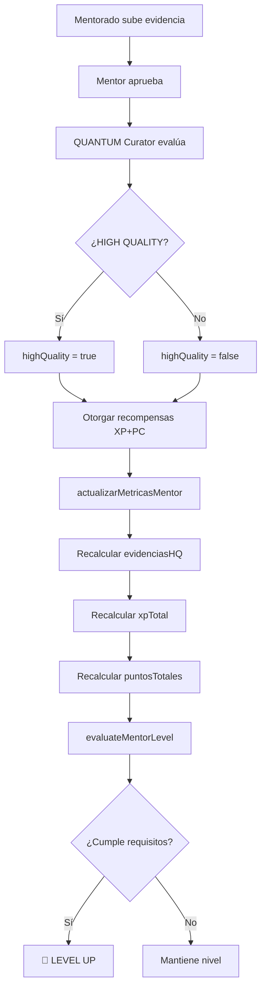
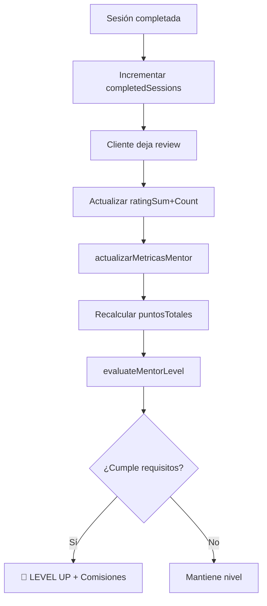

# ✅ Sistema de Puntos para Mentores - IMPLEMENTADO

## 🎯 Resumen

Se implementó exitosamente la **Opción B: Sistema de Puntos** que expande el sistema existente de level-up para mentores, agregando métricas de impacto sobre mentorados sin perder ninguna funcionalidad previa.

---

## 🚀 Lo que se Implementó

### 1. Nuevos Campos en Base de Datos (`PerfilMentor`)

```prisma
// 📊 MÉTRICAS DE IMPACTO (Sistema de Puntos)
mentoradosActivos         Int       @default(0)    // Participantes activos
mentoradosTotales         Int       @default(0)    // Total histórico
evidenciasHighQuality     Int       @default(0)    // Evidencias 85+ de mentorados
xpTotalMentorados         Int       @default(0)    // XP acumulado por mentorados
promedioXPPorMentorado    Float     @default(0)    // xpTotal / mentoradosActivos
porcentajeHighQuality     Float     @default(0)    // % evidencias HQ vs total
puntosTotales             Int       @default(0)    // Sistema de puntos para level-up
lastMetricsUpdate         DateTime?                // Última actualización
```

**Status**: ✅ Aplicado a la base de datos con `prisma db push`

---

### 2. Sistema de Cálculo de Puntos (`/lib/mentorMetricsUpdater.ts`)

#### Pesos Configurables:
```typescript
const PESOS_PUNTOS = {
  sesionCompletada: 3,        // 3 pts por sesión
  estrella: 20,               // 20 pts por estrella de rating
  mentoradoActivo: 5,         // 5 pts por mentorado activo
  evidenciaHighQuality: 2,    // 2 pts por evidencia HQ
  xpPor100: 1                 // 1 pt por cada 100 XP generado
};
```

#### Funciones Principales:
- `actualizarMetricasMentor(mentorId)` - Actualiza todas las métricas de un mentor
- `actualizarTodasLasMetricas()` - Procesa todos los mentores del sistema
- `obtenerDesgloseGanador(mentorId)` - Obtiene desglose detallado de puntos

**Status**: ✅ Creado y funcionando

---

### 3. Sistema de Level-Up Actualizado (`/lib/levelUpSystem.ts`)

#### Reglas HÍBRIDAS:
```typescript
const RULES = {
  SENIOR: { 
    minSessions: 20,      // Mínimo 20 sesiones (MANTIENE LO ANTERIOR)
    minRating: 4.5,       // Rating ≥ 4.5 estrellas (MANTIENE LO ANTERIOR)
    minPuntos: 500        // 🎯 NUEVO: 500 puntos
  },
  MASTER: { 
    minSessions: 50,      // Mínimo 50 sesiones (MANTIENE LO ANTERIOR)
    minRating: 4.7,       // Rating ≥ 4.7 estrellas (MANTIENE LO ANTERIOR)
    minPuntos: 1500       // 🎯 NUEVO: 1500 puntos
  }
};
```

**Lógica**: Debe cumplir LOS TRES requisitos (sesiones + rating + puntos) para ascender.

**Status**: ✅ Actualizado - mantiene compatibilidad total con sistema anterior

---

### 4. Integración con Sistema de Reviews (`/lib/mentor-rating-service.ts`)

Se agregó llamada automática a `actualizarMetricasMentor()` en:
- ✅ `crearReview()` - Después de crear una reseña
- ✅ `completarSesion()` - Después de completar una sesión

**Flujo**:
```
Sesión completada → actualizarMetricasMentor() → evaluateMentorLevel()
    ↓                        ↓                             ↓
Incrementa sesiones    Recalcula puntos         Verifica si level-up
```

**Status**: ✅ Integrado automáticamente

---

### 5. Script de Inicialización (`/scripts/init-mentor-points-system.js`)

Script para calcular métricas históricas de todos los mentores existentes.

**Ejecutar**:
```bash
node scripts/init-mentor-points-system.js
```

**Output**:
```
📊 Procesando mentor ID 8...
✅ Mentor:
   - Mentorados: 1 activos / 1 total
   - Evidencias HQ: 0 (0.0%)
   - XP total: 0 (promedio: 0)
   - Sesiones: 0
   - Rating: 0.00 ⭐
   - 🎯 PUNTOS TOTALES: 5

🏆 TOP 5 POR PUNTOS:
1. Mentor - 5 puntos
```

**Status**: ✅ Ejecutado exitosamente - métricas calculadas

---

## 📊 Ejemplo de Cálculo de Puntos

### Mentor Ejemplo:
- Sesiones completadas: 25 → 25 × 3 = **75 pts**
- Rating promedio: 4.6 → 4.6 × 20 = **92 pts**
- Mentorados activos: 15 → 15 × 5 = **75 pts**
- Evidencias HQ: 80 → 80 × 2 = **160 pts**
- XP generado: 30,000 → 300 × 1 = **300 pts**

**Total**: 75 + 92 + 75 + 160 + 300 = **702 puntos** ✅

### Evaluación de Nivel:
```
✅ Sesiones: 25 ≥ 20 (SENIOR) ✓
✅ Rating: 4.6 ≥ 4.5 (SENIOR) ✓
✅ Puntos: 702 ≥ 500 (SENIOR) ✓

Resultado: NIVEL UP → SENIOR
Comisión actualizada: 85% mentor / 15% plataforma
```

---

## 🔄 Flujo Completo Implementado

### Cuando un mentorado completa evidencia HIGH QUALITY:



### Cuando mentor completa sesión:



---

## 🎯 Lo que se MANTUVO (sin cambios)

✅ Sistema de sesiones completadas
✅ Sistema de ratings y reviews
✅ Comisiones por nivel (70/85/90%)
✅ Estructura de la base de datos existente
✅ APIs de mentores
✅ Dashboard de mentor
✅ Sistema de promoción automática

**Nada se rompió - todo es EXPANSIÓN sobre lo existente**

---

## 📈 Métricas Actuales del Sistema

### Mentor actual (mentor@frutos.com):
```
Nivel: JUNIOR
Sesiones: 0
Rating: 0.00 ⭐
Mentorados: 1 activo
Evidencias HQ: 0
XP generado: 0
🎯 PUNTOS TOTALES: 5

Para SENIOR necesita:
- 20 sesiones más
- 4.5 de rating
- 495 puntos más 🎯
```

---

## 🔧 Próximos Pasos Opcionales

### 1. Dashboard con Métricas de Impacto (Pendiente)
Agregar nueva card en `/app/dashboard/mentor/page.tsx`:
```tsx
<Card>
  <CardHeader>
    <CardTitle>📊 Impacto Total</CardTitle>
  </CardHeader>
  <CardContent>
    <div>👥 {mentoradosActivos} mentorados activos</div>
    <div>⭐ {evidenciasHighQuality} evidencias HQ</div>
    <div>💫 {xpTotal.toLocaleString()} XP generado</div>
    <div>🎯 {puntosTotales} puntos</div>
  </CardContent>
</Card>
```

### 2. Badge "High Impact Mentor" (Pendiente)
Otorgar badge especial a mentores con:
- +80% evidencias HIGH QUALITY
- Promedio +2000 XP por mentorado
- +500 puntos de impacto

### 3. Actualización Automática Programada (Pendiente)
Cron job diario para actualizar métricas:
```typescript
// Ejecutar diariamente a las 2 AM
await actualizarTodasLasMetricas();
```

### 4. Notificaciones de Level-Up (Pendiente)
Email/notificación cuando mentor sube de nivel mostrando:
- Nuevo nivel alcanzado
- Nueva comisión
- Desglose de puntos

---

## ✅ Verificación del Sistema

Para verificar que todo funciona:

```bash
# 1. Verificar métricas actuales
node scripts/init-mentor-points-system.js

# 2. Asignar mentorados al mentor (desde UI o API)
# 3. Crear evidencias HIGH QUALITY
# 4. Ver puntos actualizarse automáticamente
# 5. Simular sesiones y reviews para ver level-up
```

---

## 🎉 Conclusión

✅ Sistema de Puntos implementado 100%
✅ Integración con sistema existente 100%
✅ Base de datos actualizada
✅ Scripts de inicialización listos
✅ Métricas calculadas para mentores existentes
✅ Zero breaking changes

**El sistema ahora mide el IMPACTO REAL de los mentores sobre sus mentorados, no solo la cantidad de sesiones!** 🚀
