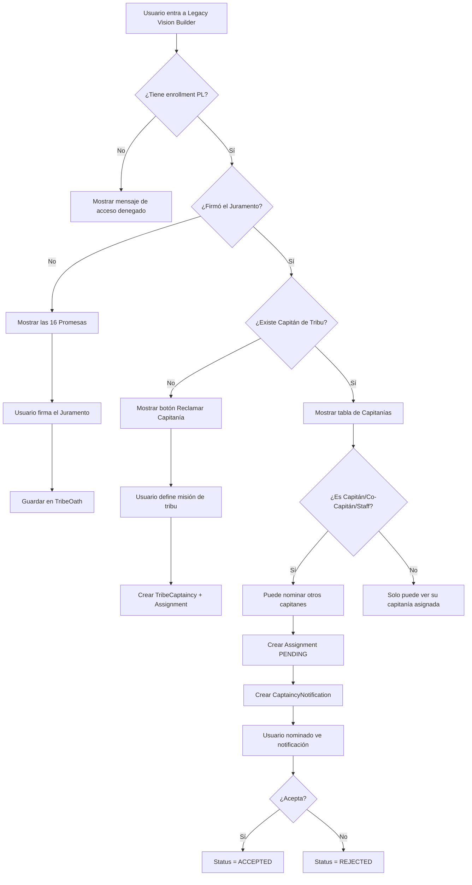

# 📜 MANUAL COMPLETO: SISTEMA DE CAPITANÍAS DE TRIBU
## Legacy Vision Builder - Plataforma Quantum Matter

**Fecha de creación:** 20 de marzo de 2026  
**Versión:** 1.0

---

## 📋 ÍNDICE

1. [Introducción](#1-introducción)
2. [El Juramento de la Tribu](#2-el-juramento-de-la-tribu)
3. [Reclamación del Capitán de Tribu](#3-reclamación-del-capitán-de-tribu)
4. [Sistema de Nominación](#4-sistema-de-nominación)
5. [Las 12 Capitanías](#5-las-12-capitanías)
6. [Widgets y Funcionalidades](#6-widgets-y-funcionalidades)
7. [Permisos y Accesos](#7-permisos-y-accesos)
8. [Base de Datos](#8-base-de-datos)
9. [Flujo Técnico](#9-flujo-técnico)

---

## 1. INTRODUCCIÓN

El **Sistema de Capitanías de Tribu** es parte del programa de **Liderato (PL)** dentro de la plataforma Quantum Matter. Solo los participantes que han completado el nivel **Avanzado** y se han inscrito en **PL (Liderato)** tienen acceso a este sistema.

### ¿Qué es una Tribu?
Una tribu es el grupo de participantes de PL dentro de una Visión. Cada tribu tiene:
- Una **misión** definida por el Capitán de Tribu
- Un **logo** propio
- **Playeras** de identidad (negra y blanca)
- **12 Capitanías** que organizan diferentes aspectos del programa

### Acceso al Sistema
- **Ruta:** `/dashboard/legacy-vision-builder`
- **Requisitos:** Estar inscrito en PL con enrollment activo (CONFIRMED, ACTIVE, ENROLLED)

---

## 2. EL JURAMENTO DE LA TRIBU

Antes de poder participar en el sistema de capitanías, cada miembro de PL debe firmar **El Juramento de la Tribu** (también llamado "Compromiso"). Este juramento consiste en **16 Promesas de Sostenibilidad**:

### Las 16 Promesas

| # | Título | Descripción |
|---|--------|-------------|
| 1 | **Salud** | Me comprometo a cuidar mi cuerpo como el templo que es. |
| 2 | **No Drogas** | Me comprometo a mantener mi mente y cuerpo libres de sustancias dañinas. |
| 3 | **Futuro Imposible** | Me comprometo a crear un futuro que antes parecía imposible. |
| 4 | **Excelencia** | Me comprometo a dar lo mejor de mí en todo lo que hago. |
| 5 | **Integridad** | Me comprometo a ser mi palabra, sin excusas. |
| 6 | **Responsabilidad** | Me comprometo a ser responsable de mi vida y mis resultados. |
| 7 | **Comunicación** | Me comprometo a comunicarme con claridad y autenticidad. |
| 8 | **Puntualidad** | Me comprometo a respetar el tiempo de los demás siendo puntual. |
| 9 | **Contribución** | Me comprometo a contribuir al bienestar de mi tribu y comunidad. |
| 10 | **Aprendizaje** | Me comprometo a ser un estudiante de la vida. |
| 11 | **Gratitud** | Me comprometo a vivir desde la gratitud. |
| 12 | **Amor** | Me comprometo a actuar desde el amor, no desde el miedo. |
| 13 | **Servicio** | Me comprometo a servir a otros desinteresadamente. |
| 14 | **Familia** | Me comprometo a honrar y fortalecer mis lazos familiares. |
| 15 | **Liderazgo** | Me comprometo a liderar con el ejemplo. |
| 16 | **Legado** | Me comprometo a dejar un legado que trascienda. |

### Proceso de Firma
1. El usuario debe **leer todas las promesas** (scroll hasta abajo)
2. **Escribir su nombre completo** como firma
3. El sistema registra: fecha, nombre, y opcionalmente imagen de firma

### Datos almacenados (tabla `TribeOath`)
```
- userId: ID del usuario
- visionId: ID de la visión
- signatureText: Nombre escrito como firma
- signatureImageUrl: URL de imagen de firma (opcional)
- signedAt: Fecha y hora de la firma
```

---

## 3. RECLAMACIÓN DEL CAPITÁN DE TRIBU

### ¿Quién puede ser Capitán de Tribu?
El **primer participante de PL** que haya firmado el juramento puede reclamar la capitanía. Es un sistema de "primero en llegar, primero en servir".

### Requisitos para Reclamar
1. ✅ Estar inscrito en **nivel PL** con enrollment activo
2. ✅ Haber **firmado el Juramento** de la Tribu
3. ✅ Que **no exista otro Capitán de Tribu** ya asignado

### Proceso de Reclamación
1. El usuario ve el botón **"Reclamar Capitanía de Tribu"**
2. Se abre un modal para **definir la misión de la tribu**
3. La misión debe tener **mínimo 10 caracteres**
4. Al confirmar:
   - Se crea la capitanía `TRIBE_CAPTAIN` en la tabla `TribeCaptaincy`
   - Se crea la asignación en estado `ACCEPTED` automáticamente
   - Se guarda la misión de la tribu en la tabla `Vision.tribeMission`

### Permisos del Capitán de Tribu
- `can_send_push_notifications` - Enviar notificaciones a la tribu
- `can_view_tribe_dashboard` - Ver dashboard de la tribu
- `can_view_attendance` - Ver asistencia
- `can_assign_captains` - **Asignar otras capitanías**

---

## 4. SISTEMA DE NOMINACIÓN

### ¿Quién puede nominar?
Solo estas personas pueden asignar capitanías:
- **Capitán de Tribu** (TRIBE_CAPTAIN)
- **Co-Capitán de Tribu** (TRIBE_CO_CAPTAIN)
- **Staff** (ADMINISTRADOR, SUPER_ADMIN, GAMECHANGER, COORDINATOR, COORDINATOR_ADVANCED)

### Proceso de Nominación
1. El nominador selecciona un **rol de capitanía**
2. Busca y selecciona un **miembro de la tribu**
3. El sistema crea una asignación en estado `PENDING`
4. Se envía una **notificación** al nominado

### Respuesta a Nominación
El usuario nominado recibe una notificación y puede:
- **Aceptar** → Estado cambia a `ACCEPTED`, se otorgan permisos
- **Rechazar** → Estado cambia a `REJECTED`

### Notificaciones (tabla `CaptaincyNotification`)
```
- assignmentId: ID de la asignación
- userId: Usuario nominado
- title: "¡Has sido postulado como [Rol]!"
- message: Descripción del rol y pregunta de aceptación
- isRead: Si ha sido leída
- readAt: Fecha de lectura
```

---

## 5. LAS 12 CAPITANÍAS

### 👑 1. CAPITÁN DE TRIBU (TRIBE_CAPTAIN)
| Campo | Valor |
|-------|-------|
| **Icono** | 👑 |
| **Misión** | Unión y Comunicación |
| **Descripción** | Líder principal de la tribu. Responsable de la unión y comunicación del equipo. |
| **Widget** | La Torre de Control (TOWER_CONTROL) |
| **Max Capitanes** | 1 |
| **Permisos** | `can_send_push_notifications`, `can_view_tribe_dashboard`, `can_view_attendance` |

**Funciones:**
- Definir y editar la misión de la tribu
- Asignar todas las demás capitanías
- Enviar notificaciones push a la tribu
- Ver dashboard general de la tribu

---

### 🎖️ 2. CO-CAPITÁN DE TRIBU (TRIBE_CO_CAPTAIN)
| Campo | Valor |
|-------|-------|
| **Icono** | 🎖️ |
| **Misión** | Apoyo en Unión y Comunicación |
| **Descripción** | Apoyo del Capitán de Tribu. Asiste en la coordinación y comunicación. |
| **Widget** | La Torre de Control (TOWER_CONTROL) |
| **Max Capitanes** | 1 |
| **Permisos** | `can_send_push_notifications`, `can_view_tribe_dashboard` |

**Funciones:**
- Asistir al Capitán de Tribu
- También puede asignar capitanías
- Enviar notificaciones a la tribu

---

### 💰 3. TESORERO (TREASURER)
| Campo | Valor |
|-------|-------|
| **Icono** | 💰 |
| **Misión** | Administración financiera de la tribu |
| **Descripción** | Encargado de colectar fondos, ganar-ganar, cero deudas. |
| **Widget** | Bóveda de Tribu (VAULT) - TreasuryWidgetV2 |
| **Max Capitanes** | 1 |
| **Permisos** | `can_create_payment_links`, `can_view_payment_status`, `can_create_fundraising` |

**Funciones en el Widget:**
- **Pestaña Banco:** 
  - Configurar datos bancarios de la tribu (CLABE, banco, titular)
  - Ver estado de cuenta
- **Pestaña Ingresos:**
  - Ver pagos recibidos
  - Verificar comprobantes de pago
  - Marcar pagos como verificados/rechazados
- **Pestaña Playeras:**
  - Crear productos de playeras con precios
  - Ver tallas registradas de cada miembro
  - Generar órdenes de pago por playeras
  - Marcar pagos de playeras como recibidos
- **Sistema de Proyectos:**
  - Crear conceptos de pago para proyectos de la tribu
  - Cobrar cuotas grupales

---

### 👕 4. CAPITÁN DE PLAYERAS Y LOGO (SHIRTS_LOGO)
| Campo | Valor |
|-------|-------|
| **Icono** | 👕 |
| **Misión** | Identidad Visual |
| **Descripción** | Encargado de la identidad visual de la tribu (playera negra y blanca). |
| **Widget** | Identity Lab (/dashboard/identity-lab) |
| **Max Capitanes** | 1 |
| **Permisos** | `can_manage_logo_voting`, `can_collect_shirt_sizes` |

**Funciones:**
- **Votación de Logo:**
  - Crear encuestas para elegir el logo de la tribu
  - Subir opciones de diseño con imágenes
  - Cerrar votación y establecer logo ganador
- **Tallas de Playeras:**
  - Recolectar tallas de cada miembro
  - Ver resumen de tallas por cantidad
- **Gestión de Identidad:**
  - Actualizar el logo oficial en la visión
  - Coordinar con el Tesorero para cobros

---

### 🎓 5. CAPITÁN DE CONTRIBUCIÓN BÁSICOS (CONTRIBUTION_BASIC)
| Campo | Valor |
|-------|-------|
| **Icono** | 🎓 |
| **Misión** | Contribución en Entrenamientos Básicos |
| **Descripción** | Presencia activa en graduaciones de Básicos. |
| **Widget** | Logística de Eventos (EVENT_LOGISTICS) - Captaincy Widget |
| **Max Capitanes** | 1 |
| **Permisos** | `can_view_basic_calendar`, `can_check_in_attendance` |

**Funciones:**
- Coordinar la participación en graduaciones de Básicos
- Crear votaciones sobre asignaciones
- Ver calendario de eventos Básicos
- Registrar asistencia de la tribu

---

### 🎓 6. CAPITÁN DE CONTRIBUCIÓN AVANZADOS (CONTRIBUTION_ADVANCED)
| Campo | Valor |
|-------|-------|
| **Icono** | 🎓 |
| **Misión** | Contribución en Entrenamientos Avanzados |
| **Descripción** | Presencia activa en graduaciones y cunas de Avanzados. |
| **Widget** | Logística de Eventos (EVENT_LOGISTICS) - Captaincy Widget |
| **Max Capitanes** | 1 |
| **Permisos** | `can_view_advanced_calendar`, `can_check_in_attendance` |

**Funciones:**
- Coordinar contribución en cunas y graduaciones Avanzados
- Crear votaciones de proyectos avanzados
- Mentoría de contribución para miembros más nuevos

---

### 🤝 7. CAPITÁN DE COMUNITARIA GRUPAL (COMMUNITY_SERVICE)
| Campo | Valor |
|-------|-------|
| **Icono** | 🤝 |
| **Misión** | El día especial de servicio |
| **Descripción** | Encargado de coordinar el día especial de servicio comunitario. |
| **Widget** | Legacy Forge (/dashboard/legacy-forge) - Democracia Cuántica |
| **Max Capitanes** | 1 |
| **Permisos** | `can_manage_community_proposals`, `can_assign_tribe_tasks` |

**Funciones en Legacy Forge:**
- **Crear Campañas de Crowdfunding:**
  - Definir título, descripción e historia
  - Establecer meta de recaudación
  - Subir video explicativo
- **Gestionar Propuestas:**
  - Recibir propuestas de proyectos comunitarios
  - Crear votaciones para elegir proyecto
- **Asignar Tareas:**
  - Distribuir responsabilidades entre miembros

---

### 📚 8. CAPITÁN DE LIBROS Y PELÍCULAS (BOOKS_MOVIES)
| Campo | Valor |
|-------|-------|
| **Icono** | 📚 |
| **Misión** | Aprendizaje continuo |
| **Descripción** | Asegurar lectura y resúmenes de libros/películas asignadas. |
| **Widget** | Sistema de Aprendizaje (LMS) - Captaincy Widget |
| **Max Capitanes** | 1 |
| **Permisos** | `can_view_homework_status`, `can_send_homework_reminders` |

**Funciones:**
- Crear votaciones sobre libros/películas a asignar
- Ver estado de tareas de lectura de cada miembro
- Enviar recordatorios de tareas pendientes
- Validar resúmenes entregados

---

### 🍽️ 9. CAPITÁN DE COMIDAS (FOOD)
| Campo | Valor |
|-------|-------|
| **Icono** | 🍽️ |
| **Misión** | Alimentación saludable |
| **Descripción** | Nutrición congruente y saludable para la tribu. |
| **Widget** | Menú Planner (MENU_PLANNER) - Captaincy Widget |
| **Max Capitanes** | 1 |
| **Permisos** | `can_manage_food_allergies`, `can_coordinate_meals` |

**Funciones:**
- Organizar convivios de la tribu
- Crear votaciones para elegir menús
- Registrar alergias alimentarias de miembros
- Coordinar presupuesto de alimentos con Tesorero
- Asignar responsables de comidas por evento

---

### ✨ 10. CAPITÁN DE VESTIMENTA Y LIMPIEZA (CLEANLINESS)
| Campo | Valor |
|-------|-------|
| **Icono** | ✨ |
| **Misión** | Excelencia en imagen y orden |
| **Descripción** | Códigos de vestimenta y espacios impecables. |
| **Widget** | Auditoría Diaria (DAILY_AUDIT) - Captaincy Widget |
| **Max Capitanes** | 1 |
| **Permisos** | `can_submit_audit_checklist`, `can_report_issues` |

**Funciones:**
- Definir y comunicar códigos de vestimenta
- Crear votaciones sobre uniformes
- Realizar auditorías de espacios
- Reportar problemas de limpieza/orden
- Asignar roles de limpieza por evento

---

### ⚖️ 11. GUARDIÁN DEL CONTEXTO (CONTEXT_GUARDIAN)
| Campo | Valor |
|-------|-------|
| **Icono** | ⚖️ |
| **Misión** | Integridad y cumplimiento de reglas |
| **Descripción** | El rol más difícil. Reglas, calendarios, dispuesto a ser 'odiado' por integridad. |
| **Widget** | El Libro de la Ley (BOOK_OF_LAW) - ContextGuardianWidget |
| **Max Capitanes** | 1 |
| **Permisos** | `can_view_rules`, `can_report_breach` |

**Funciones en el Widget:**
- **Reportar Incumplimientos:**
  - Tardanzas a actividades
  - Inasistencias sin aviso
  - Consumo de sustancias prohibidas
  - Conflictos entre miembros
  - Incumplimiento de acuerdos
  - Faltas de respeto
- **Gestionar Reportes:**
  - Asignar severidad (Leve, Moderado, Grave)
  - Subir evidencia fotográfica
  - Ver historial de reportes
  - Filtrar por miembro o tipo de falta

---

### 🎉 12. CAPITÁN DE GRADUACIÓN (GRADUATION_CAPTAIN)
| Campo | Valor |
|-------|-------|
| **Icono** | 🎉 |
| **Misión** | Coordinación de la graduación |
| **Descripción** | Encargado de crear la experiencia final de celebración en el 3er Fin de Semana. |
| **Widget** | Event Planner Graduación (EVENT_PLANNER) - Captaincy Widget |
| **Max Capitanes** | 1 |
| **Permisos** | `can_manage_guest_list`, `can_generate_qr_tickets` |

**Funciones:**
- Planear ceremonia de graduación
- Crear votaciones sobre formato y lugar
- Gestionar lista de invitados
- Generar tickets QR para invitados
- Coordinar celebración post-graduación
- Asignar roles para el día del evento

---

## 6. WIDGETS Y FUNCIONALIDADES

### Tipos de Widget por Capitanía

| Widget Type | Widget Name | Capitanías que lo usan | Ruta |
|-------------|-------------|------------------------|------|
| `TOWER_CONTROL` | La Torre de Control | TRIBE_CAPTAIN, TRIBE_CO_CAPTAIN | Dashboard principal |
| `VAULT` | Bóveda de Tribu | TREASURER | `/dashboard/captaincy-widget?roleType=TREASURER` |
| `IDENTITY_MANAGER` | Gestor de Identidad | SHIRTS_LOGO | `/dashboard/identity-lab` |
| `EVENT_LOGISTICS` | Logística de Eventos | CONTRIBUTION_BASIC, CONTRIBUTION_ADVANCED | `/dashboard/captaincy-widget` |
| `PROJECT_MANAGER` | Project Manager Comunitaria | COMMUNITY_SERVICE | `/dashboard/legacy-forge` |
| `LMS` | Sistema de Aprendizaje | BOOKS_MOVIES | `/dashboard/captaincy-widget` |
| `MENU_PLANNER` | Menú Planner | FOOD | `/dashboard/captaincy-widget` |
| `DAILY_AUDIT` | Auditoría Diaria | CLEANLINESS | `/dashboard/captaincy-widget` |
| `BOOK_OF_LAW` | El Libro de la Ley | CONTEXT_GUARDIAN | `/dashboard/captaincy-widget?roleType=CONTEXT_GUARDIAN` |
| `EVENT_PLANNER` | Event Planner Graduación | GRADUATION_CAPTAIN | `/dashboard/captaincy-widget` |

### Sistema de Votaciones (TribePollWidget)

Casi todas las capitanías tienen acceso a crear **votaciones** para su área:

```typescript
// Categorías de votación por capitanía
const CATEGORY_BY_ROLE = {
  'COMMUNITY_SERVICE': ['COMMUNITY', 'GENERAL'],
  'SHIRTS_LOGO': ['LOGO', 'SHIRT', 'GENERAL'],
  'FOOD': ['FOOD', 'GENERAL'],
  'GRADUATION_CAPTAIN': ['GRADUATION', 'VENUE', 'GENERAL'],
  // ... etc
};
```

**Funciones de votación:**
- Crear encuestas con múltiples opciones
- Subir imágenes por opción
- Establecer fecha límite
- Ver resultados en tiempo real
- Chat/comentarios por votación

---

## 7. PERMISOS Y ACCESOS

### Jerarquía de Acceso

```
SUPER_ADMIN / ADMINISTRADOR
    └── Staff de la Visión
        └── TRIBE_CAPTAIN
            └── TRIBE_CO_CAPTAIN
                └── Capitán específico
                    └── Miembro de tribu regular
```

### Tabla de Permisos por Rol

| Permiso | TRIBE_CAPTAIN | CO_CAPTAIN | TREASURER | Otros |
|---------|---------------|------------|-----------|-------|
| Asignar capitanías | ✅ | ✅ | ❌ | ❌ |
| Ver dashboard tribu | ✅ | ✅ | ❌ | ❌ |
| Enviar notificaciones | ✅ | ✅ | ❌ | ❌ |
| Ver asistencia | ✅ | ❌ | ❌ | ❌ |
| Crear links de pago | ❌ | ❌ | ✅ | ❌ |
| Ver estado de pagos | ❌ | ❌ | ✅ | ❌ |
| Acceso a su widget | ✅ | ✅ | ✅ | ✅ |

### Acceso a Widgets de Otros Roles

El **Capitán de Tribu** y **Co-Capitán** tienen acceso a **todos los widgets** de las demás capitanías, incluso si no son el capitán asignado.

---

## 8. BASE DE DATOS

### Tablas Principales

#### TribeCaptaincy
```prisma
model TribeCaptaincy {
  id          Int                      @id @default(autoincrement())
  visionId    Int
  roleType    TribeCaptaincyRole       // Enum con los 12 roles
  maxCaptains Int                      @default(1)
  isActive    Boolean                  @default(true)
  createdAt   DateTime                 @default(now())
  updatedAt   DateTime                 @updatedAt
  
  Vision                Vision                    @relation(...)
  TribeCaptainAssignment TribeCaptainAssignment[]
  
  @@unique([visionId, roleType])
}
```

#### TribeCaptainAssignment
```prisma
model TribeCaptainAssignment {
  id           Int                     @id @default(autoincrement())
  captaincyId  Int
  userId       Int
  nominatedBy  Int?                    // Quién lo nominó
  status       CaptainAssignmentStatus // PENDING, ACCEPTED, REJECTED, REMOVED
  permissions  Json?                   // Array de permisos
  acceptedAt   DateTime?
  rejectedAt   DateTime?
  removedAt    DateTime?
  createdAt    DateTime                @default(now())
  
  TribeCaptaincy TribeCaptaincy @relation(...)
  Usuario        Usuario        @relation(...)
  
  @@unique([captaincyId, userId])
}
```

#### TribeOath
```prisma
model TribeOath {
  id                 Int       @id @default(autoincrement())
  userId             Int
  visionId           Int
  signatureText      String
  signatureImageUrl  String?
  signedAt           DateTime  @default(now())
  ipAddress          String?
  userAgent          String?
  
  Usuario Usuario @relation(...)
  Vision  Vision  @relation(...)
  
  @@unique([userId, visionId])
}
```

#### CaptaincyNotification
```prisma
model CaptaincyNotification {
  id           Int       @id @default(autoincrement())
  assignmentId Int
  userId       Int
  title        String
  message      String
  isRead       Boolean   @default(false)
  readAt       DateTime?
  createdAt    DateTime  @default(now())
}
```

### Enum de Roles
```prisma
enum TribeCaptaincyRole {
  TRIBE_CAPTAIN
  TRIBE_CO_CAPTAIN
  TREASURER
  SHIRTS_LOGO
  CONTRIBUTION_BASIC
  CONTRIBUTION_ADVANCED
  COMMUNITY_SERVICE
  BOOKS_MOVIES
  FOOD
  CLEANLINESS
  CONTEXT_GUARDIAN
  GRADUATION_CAPTAIN
}
```

### Enum de Estados
```prisma
enum CaptainAssignmentStatus {
  PENDING
  ACCEPTED
  REJECTED
  REMOVED
}
```

---

## 9. FLUJO TÉCNICO

### Flujo Completo de Capitanías



### API Endpoints

| Método | Endpoint | Acción |
|--------|----------|--------|
| GET | `/api/legacy-vision-builder` | Obtener estado del sistema |
| POST | `/api/legacy-vision-builder` | Acciones varias (ver abajo) |

### Acciones POST Disponibles

```typescript
// Firmar juramento
{ action: 'sign_oath', visionId, signatureText, signatureImageUrl? }

// Reclamar capitanía de tribu
{ action: 'claim_tribe_captain', visionId, tribeMission }

// Actualizar misión de tribu
{ action: 'update_mission', visionId, tribeMission }

// Nominar capitán
{ action: 'nominate_captain', visionId, roleType, nominatedUserId }

// Responder nominación
{ action: 'respond_nomination', assignmentId, accept: boolean }

// Remover capitán
{ action: 'remove_captain', assignmentId }

// Actualizar logo de tribu
{ action: 'updateTribeLogo', visionId, logoUrl }
```

---

## 📝 NOTAS FINALES

### Consideraciones Importantes

1. **Solo 1 capitán por rol** (excepto si se modifica `maxCaptains`)
2. **El juramento es requisito obligatorio** antes de cualquier acción
3. **El primer participante en reclamar** se convierte en Capitán de Tribu
4. **Las nominaciones requieren aceptación** del usuario nominado
5. **Los permisos se almacenan en JSON** para flexibilidad
6. **El Capitán de Tribu puede ser removido** solo por Staff

### Archivos Clave del Sistema

```
/app/api/legacy-vision-builder/route.ts    - API principal
/app/dashboard/legacy-vision-builder/      - Página principal
/app/dashboard/captaincy-widget/           - Widget genérico
/app/dashboard/legacy-forge/               - Comunitaria
/app/dashboard/identity-lab/               - Playeras y Logo
/components/captaincy/TreasuryWidgetV2.tsx - Tesorería
/components/captaincy/ContextGuardianWidget.tsx - Guardián
/app/components/TribePollWidget.tsx        - Sistema de votaciones
```

---

**Documento creado para la Plataforma Quantum Matter**  
**© 2026 Impacto Cuántico**
