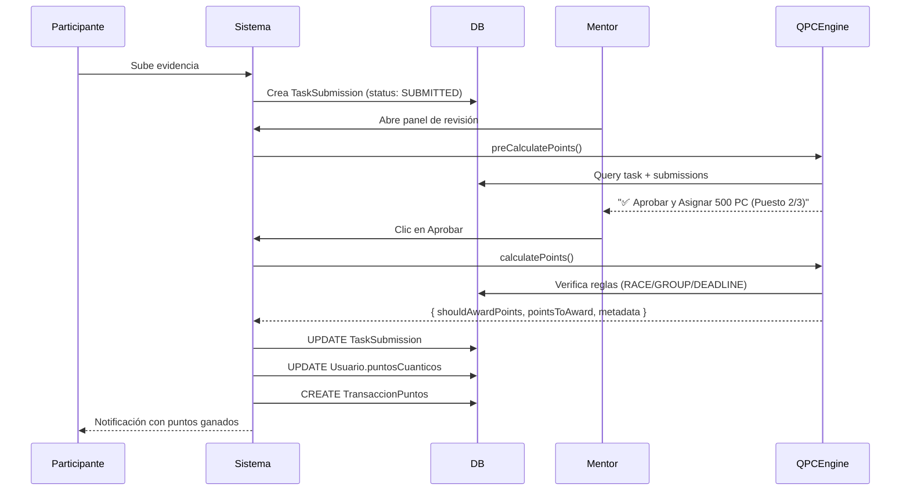

# 🎯 QPC Engine - Sistema de Recompensas Cuánticas

## ✅ Estado: Fase 1 Completada - Schema y Motor de Cálculo

### 📦 Componentes Implementados

#### 1. Schema de Base de Datos ✅
**Archivo**: `prisma/schema.prisma`

**AdminTask - Nuevos campos**:
```prisma
rewardLogic     RewardLogic     @default(STANDARD)
raceLimit       Int?            // Cupo para modo RACE
strictDeadline  Boolean         @default(false)
```

**TaskSubmission - Nuevos campos**:
```prisma
rewardMetadata      Json?       // Metadata de cálculo
pointsCalculatedAt  DateTime?   // Timestamp del cálculo
```

**Nuevo Enum - RewardLogic**:
```prisma
enum RewardLogic {
  STANDARD           // Todos reciben puntos
  RACE              // Solo primeros X reciben puntos completos
  GROUP_ALL         // Todo el grupo debe completar
  GROUP_THRESHOLD   // X% del grupo debe completar
  STRICT_DEADLINE   // 0 puntos si entrega tarde
}
```

**Migración**: Aplicada con `prisma db push` el 21/12/2025 ✅

---

#### 2. Motor de Cálculo ✅
**Archivo**: `/lib/qpc-engine.ts`

**Clase principal**: `QPCEngine`

**Método principal**:
```typescript
static async calculatePoints(
  submissionId: number,
  taskId: number,
  userId: number
): Promise<QPCCalculationResult>
```

**Algoritmos implementados**:

##### A) STANDARD Mode
- ✅ Todos los usuarios que completan reciben puntos base
- Sin condiciones especiales

##### B) RACE Mode (Carrera de Cupos)
- ✅ Lee `raceLimit` del AdminTask (ej: 3 ganadores)
- ✅ Cuenta aprobaciones existentes
- ✅ Si quedan cupos: asigna puntos completos + posición
- ✅ Si no quedan cupos: premio consolación (10% de puntos)
- ✅ Metadata incluye: `position`, `raceLimit`, `totalWinners`

##### C) GROUP_ALL Mode
- ✅ Verifica que TODOS del grupo/visión completen
- ✅ Puntos se mantienen en 0 hasta que el último complete
- ✅ Metadata incluye: `groupProgress` (completed/total/percentage)

##### D) GROUP_THRESHOLD Mode
- ✅ Requiere X% del grupo (por defecto 70%)
- ✅ Calcula progreso del grupo
- ✅ Libera puntos cuando se alcanza el umbral
- ✅ Metadata incluye: `groupProgress`

##### E) STRICT_DEADLINE Mode (Modo Wizard)
- ✅ Compara `submission.submittedAt` vs `task.deadline`
- ✅ Si tarde: 0 puntos + mensaje disciplinario
- ✅ Si a tiempo: puntos completos
- ✅ Metadata incluye: `lateSubmission`, `deadline`, `submittedAt`, tiempo de retraso

**Método de pre-visualización**:
```typescript
static async preCalculatePoints(...)
```
- Permite al mentor ver cuántos puntos se otorgarán ANTES de aprobar

---

### 🔄 Flujo de Aprobación de Evidencias



---

### 📋 Pendientes - Fase 2

#### 1. Endpoint de Aprobación
**Archivo a modificar**: `/app/api/tareas/[id]/approve/route.ts`

```typescript
// Integrar QPC Engine
const calculation = await QPCEngine.calculatePoints(
  submissionId,
  taskId,
  userId
);

if (calculation.shouldAwardPoints) {
  // Actualizar puntos usuario
  await prisma.usuario.update({
    where: { id: userId },
    data: { 
      puntosCuanticos: { increment: calculation.pointsToAward }
    }
  });

  // Crear transacción
  await prisma.transaccionPuntos.create({
    data: {
      usuarioId: userId,
      cantidad: calculation.pointsToAward,
      tipo: 'GANANCIA',
      trigger_event: 'task_approval',
      descripcion: calculation.reason
    }
  });
}

// Guardar metadata
await prisma.taskSubmission.update({
  where: { id: submissionId },
  data: {
    status: 'APPROVED',
    puntosGanados: calculation.pointsToAward,
    rewardMetadata: calculation.metadata,
    pointsCalculatedAt: new Date()
  }
});
```

#### 2. UI - Panel de Revisión del Mentor
**Archivo a crear/modificar**: `/app/dashboard/mentor/review/[id]/page.tsx`

Agregar:
```tsx
// Pre-calcular antes de mostrar
const calculation = await QPCEngine.preCalculatePoints(...);

// Mostrar badge según lógica
{calculation.metadata.logic === 'RACE' && (
  <Badge>
    🔥 Puesto {calculation.metadata.position}/{calculation.metadata.raceLimit}
  </Badge>
)}

{calculation.metadata.lateSubmission && (
  <Alert variant="destructive">
    ⚠️ Entrega tardía. No se otorgarán puntos.
  </Alert>
)}

// Botón de aprobar
<Button onClick={handleApprove}>
  ✅ Aprobar y Asignar {calculation.pointsToAward} PC
</Button>
```

#### 3. UI - Formulario de Creación de Tareas
**Archivo a modificar**: `/app/dashboard/admin/tareas/nueva/page.tsx`

Agregar:
```tsx
<Select name="rewardLogic">
  <option value="STANDARD">Estándar (Todos ganan)</option>
  <option value="RACE">🏁 Carrera (Solo primeros X)</option>
  <option value="GROUP_ALL">👥 Grupo Completo</option>
  <option value="GROUP_THRESHOLD">📊 Umbral Grupal</option>
  <option value="STRICT_DEADLINE">⏰ Puntualidad Estricta</option>
</Select>

{rewardLogic === 'RACE' && (
  <Input 
    name="raceLimit" 
    type="number" 
    placeholder="Número de ganadores (ej: 3)"
  />
)}

{rewardLogic === 'STRICT_DEADLINE' && (
  <Checkbox name="strictDeadline">
    Modo Wizard: 0 puntos si entrega tarde
  </Checkbox>
)}
```

#### 4. Widget de Contador en Tiempo Real
Para modo RACE, mostrar en dashboard:
```tsx
<Card>
  <h3>🏁 Carrera Activa</h3>
  <p>Quedan {remainingSlots}/{task.raceLimit} lugares</p>
  <Progress value={(approvedCount/raceLimit)*100} />
</Card>
```

#### 5. Testing de Escenarios

**Casos de prueba requeridos**:

1. **RACE Mode**:
   - [ ] Crear tarea con `raceLimit=3` y `pointsReward=500`
   - [ ] 5 usuarios suben evidencia
   - [ ] Aprobar en orden: 1ro, 2do, 3ro (reciben 500 PC cada uno)
   - [ ] Aprobar 4to y 5to (reciben 50 PC cada uno - consolación)
   - [ ] Verificar metadata.position en cada submission

2. **STRICT_DEADLINE Mode**:
   - [ ] Crear tarea deadline: 21/12/2025 16:00
   - [ ] Usuario A sube a las 15:50 → Aprobar → 500 PC ✅
   - [ ] Usuario B sube a las 16:30 → Aprobar → 0 PC ❌
   - [ ] Verificar metadata.lateSubmission y diff de tiempo

3. **GROUP_ALL Mode**:
   - [ ] Crear tarea para Visión 1 (10 miembros)
   - [ ] Aprobar evidencias de 9 usuarios → 0 PC para todos
   - [ ] Aprobar evidencia del 10mo → Trigger: 500 PC para cada uno
   - [ ] Verificar transacciones se crean correctamente

4. **GROUP_THRESHOLD Mode**:
   - [ ] Crear tarea para 10 usuarios, threshold 70%
   - [ ] Aprobar 7 evidencias → Todos reciben puntos
   - [ ] Aprobar 8vo y 9no → También reciben puntos
   - [ ] 10mo no completa → No afecta a los demás

---

### 🚀 Deployment Checklist

- [x] Schema actualizado en DB
- [x] Prisma Client regenerado
- [x] QPC Engine creado (`/lib/qpc-engine.ts`)
- [ ] Endpoint de aprobación modificado
- [ ] Panel de revisión de mentor actualizado
- [ ] Formulario de creación de tareas actualizado
- [ ] Widget de contador en tiempo real (RACE mode)
- [ ] Tests de integración completados
- [ ] Documentación de usuario creada
- [ ] Migration script para tareas existentes (todas → STANDARD)

---

### 📊 Ejemplo de rewardMetadata

```json
{
  "logic": "RACE",
  "position": 2,
  "totalWinners": 3,
  "raceLimit": 3
}
```

```json
{
  "logic": "STRICT_DEADLINE",
  "lateSubmission": true,
  "deadline": "2025-12-21T16:00:00.000Z",
  "submittedAt": "2025-12-21T16:45:00.000Z"
}
```

```json
{
  "logic": "GROUP_ALL",
  "groupProgress": {
    "completed": 10,
    "total": 10,
    "percentage": 100
  }
}
```

---

### 🎮 Casos de Uso Reales

1. **Challenge Matutino 5AM** (RACE)
   - "Primeros 5 en subir evidencia de su rutina matutina ganan 1000 PC"
   - Los demás ganan 100 PC por participar

2. **Misión Grupal Visión Phoenix** (GROUP_ALL)
   - "Todos deben completar para desbloquear 2000 PC c/u"
   - Fomenta trabajo en equipo y accountability

3. **Tarea Wizard: Carta de Frutos** (STRICT_DEADLINE)
   - "Deadline: Domingo 23:59. Entrega tardía = 0 puntos"
   - Disciplina estricta para nivel avanzado

4. **Meta Colectiva 70%** (GROUP_THRESHOLD)
   - "Si al menos 7 de 10 completan, todos ganan"
   - Balance entre exigencia y flexibilidad

---

### 🔧 Mantenimiento

**Logs importantes**:
- `rewardMetadata`: Auditoría completa de por qué se otorgaron/negaron puntos
- `pointsCalculatedAt`: Timestamp para debugging temporal
- `TransaccionPuntos.trigger_event`: Rastreo de origen de puntos

**Rollback**:
Si se necesita deshacer cambios:
```sql
ALTER TABLE "AdminTask" DROP COLUMN "rewardLogic";
ALTER TABLE "AdminTask" DROP COLUMN "raceLimit";
ALTER TABLE "AdminTask" DROP COLUMN "strictDeadline";
ALTER TABLE "TaskSubmission" DROP COLUMN "rewardMetadata";
ALTER TABLE "TaskSubmission" DROP COLUMN "pointsCalculatedAt";
DROP TYPE "RewardLogic";
```

---

## 🎯 Próximos Pasos

1. Implementar endpoint `/api/tareas/[id]/approve`
2. Actualizar UI del mentor para mostrar pre-cálculo
3. Agregar selector de RewardLogic en form de creación
4. Testing exhaustivo de cada modo
5. Crear documentación de usuario (Notion/Markdown)

**Fecha de implementación**: 21 de diciembre de 2025  
**Estado**: Schema y Engine ✅ | Integración UI 🔄
