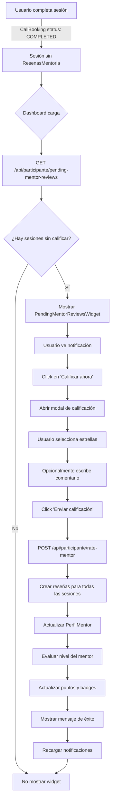

# 🌟 Sistema de Calificación de Mentores al Finalizar Ciclo - IMPLEMENTADO

## ✅ Resumen de Implementación

Se ha implementado un sistema automático de notificaciones que invita a los usuarios participantes a calificar a sus mentores después de completar un ciclo de sesiones de mentoría.

---

## 📋 Funcionalidades Implementadas

### 1. **API de Detección de Sesiones Pendientes de Calificar**
- **Endpoint:** `GET /api/participante/pending-mentor-reviews`
- **Archivo:** `/app/api/participante/pending-mentor-reviews/route.ts`

#### Características:
- Detecta sesiones completadas sin reseña asociada
- Agrupa sesiones por mentor para identificar ciclos
- Calcula prioridad de notificación:
  - **ALTA**: 3+ sesiones completadas (ciclo completo)
  - **MEDIA**: 1 sesión completada
  - **BAJA**: 2 sesiones completadas
- Ordena notificaciones por prioridad
- Incluye información completa del mentor:
  - Nombre, imagen, título, especialidad
  - Rating actual
  - Número de sesiones pendientes de calificar

#### Response:
```json
{
  "success": true,
  "notificaciones": [
    {
      "mentorId": 5,
      "mentorNombre": "Carlos Mentor",
      "mentorImagen": "https://...",
      "mentorTitulo": "Mentor Senior",
      "mentorEspecialidad": "Liderazgo",
      "mentorRating": 4.8,
      "perfilMentorId": 3,
      "visionNombre": "Visión Phoenix 2025",
      "totalSesiones": 5,
      "prioridad": "ALTA",
      "mensaje": "Has completado 5 sesiones con Carlos Mentor. ¡Es momento de calificar tu experiencia!"
    }
  ],
  "totalPendientes": 5,
  "mentoresPendientes": 1
}
```

---

### 2. **API de Calificación de Mentor**
- **Endpoint:** `POST /api/participante/rate-mentor`
- **Archivo:** `/app/api/participante/rate-mentor/route.ts`

#### Características:
- Califica TODAS las sesiones completadas sin review con un mentor específico
- Crea reseñas utilizando el sistema existente (`crearReview()`)
- Actualiza automáticamente:
  - `ratingSum` y `ratingCount` del mentor
  - `calificacionPromedio` del PerfilMentor
  - Evaluación de nivel del mentor (JUNIOR → SENIOR → MASTER)
  - Sistema de puntos y badges
- Crea `SolicitudMentoria` si no existe (requerido por el schema)

#### Request Body:
```json
{
  "mentorId": 5,
  "perfilMentorId": 3,
  "calificacion": 5,
  "comentario": "Excelente mentor, me ayudó mucho en mi crecimiento personal",
  "sharedResources": true
}
```

#### Response:
```json
{
  "success": true,
  "message": "¡Gracias por tu feedback! Se calificaron 5 sesión(es)",
  "data": {
    "resenasCreadas": 5,
    "sesionesCalificadas": 5,
    "nuevoRating": 4.85,
    "totalResenas": 23,
    "nivelMentor": "SENIOR"
  }
}
```

#### Validaciones:
- ✅ Usuario autenticado
- ✅ Calificación entre 1-5 estrellas
- ✅ Sesiones pertenecen al usuario
- ✅ Sesiones con status COMPLETED
- ✅ Sesiones sin reseña previa

---

### 3. **Widget de Notificaciones en Dashboard**
- **Componente:** `<PendingMentorReviewsWidget />`
- **Archivo:** `/components/dashboard/PendingMentorReviewsWidget.tsx`
- **Integrado en:** `/app/dashboard/page.tsx`

#### Características del Widget:

**a) Diseño Visual:**
- Cards con gradientes según prioridad:
  - ALTA: Gradiente purple/pink con animación pulse
  - MEDIA: Gradiente blue/cyan
  - BAJA: Gris oscuro
- Icono dinámico según prioridad (✨ Sparkles para ALTA, ⭐ Star para otras)
- Foto del mentor incluida
- Badge "Ciclo completado" para prioridad ALTA

**b) Información Mostrada:**
- Nombre y título del mentor
- Rating actual del mentor
- Número de sesiones pendientes
- Mensaje personalizado según número de sesiones
- Botón CTA "Calificar ahora" con gradiente

**c) Modal de Calificación:**
- Sistema de 5 estrellas interactivo
  - Hover effect con animación
  - Mensajes dinámicos según calificación:
    - 5 estrellas: "🌟 ¡Excelente!"
    - 4 estrellas: "😊 Muy bueno"
    - 3 estrellas: "👍 Bueno"
    - 2 estrellas: "😐 Regular"
    - 1 estrella: "😞 Necesita mejorar"
- Campo de comentario opcional (textarea)
- Checkbox "Mi mentor compartió recursos útiles"
- Muestra información del mentor (foto, nombre, título)
- Info de cuántas sesiones se calificarán
- Loading state durante el envío
- Mensaje de éxito animado con checkmark verde

**d) Experiencia de Usuario:**
1. Widget aparece automáticamente en el dashboard
2. Solo visible para roles PARTICIPANTE y LIDER
3. Si no hay sesiones pendientes, no se muestra
4. Al hacer click en una notificación, abre el modal
5. Usuario selecciona estrellas, opcionalmente escribe comentario
6. Click en "Enviar calificación"
7. Mensaje de éxito por 2 segundos
8. Recarga automática de notificaciones
9. Widget desaparece si ya no hay pendientes

---

## 🔄 Flujo Completo del Sistema



---

## 🎯 Detección de Ciclos

El sistema detecta automáticamente cuándo un usuario ha completado un ciclo significativo:

### Criterios de Prioridad:
- **Ciclo Completo (ALTA):** 3 o más sesiones sin calificar
  - Mensaje: "Has completado X sesiones con [Mentor]. ¡Es momento de calificar tu experiencia!"
  
- **Sesión Única (MEDIA):** 1 sesión sin calificar
  - Mensaje: "Completaste una sesión con [Mentor]. ¿Cómo fue tu experiencia?"
  
- **Sesiones Múltiples (BAJA):** 2 sesiones sin calificar
  - Mensaje: "Tienes X sesiones pendientes de calificar con [Mentor]"

---

## 📊 Integración con Sistema Existente

### Conexiones con Otros Sistemas:

1. **Sistema de Reviews (`/lib/mentor-rating-service.ts`)**
   - Usa `crearReview()` para registrar calificaciones
   - Actualiza automáticamente métricas del mentor
   
2. **Sistema de Level-Up (`/lib/levelUpSystem.ts`)**
   - Se ejecuta automáticamente después de cada review
   - Evalúa si mentor debe subir de nivel
   
3. **Sistema de Badges (`/lib/badgeSystem.ts`)**
   - Otorga insignias según comportamiento del mentor
   - Badge "Erudito" si comparte recursos
   
4. **Sistema de Puntos (`/lib/mentorMetricsUpdater.ts`)**
   - Recalcula puntos totales del mentor
   - Considera calificación en el scoring

---

## 🎨 Diseño del Widget

### Estados Visuales:

**1. Loading:**
```tsx
// No muestra nada mientras carga (evita flash)
if (loading) return null;
```

**2. Sin Notificaciones:**
```tsx
// No muestra el widget si no hay pendientes
if (notificaciones.length === 0) return null;
```

**3. Con Notificaciones:**
```tsx
// Cards apiladas verticalmente
<div className="space-y-4">
  {notificaciones.map((notif) => (
    // Card con gradiente según prioridad
  ))}
</div>
```

**4. Modal Abierto:**
```tsx
// Overlay con backdrop blur
<div className="fixed inset-0 bg-black/70 backdrop-blur-sm">
  // Modal centrado con animaciones
</div>
```

**5. Éxito:**
```tsx
// Checkmark verde animado
<CheckCircle className="w-12 h-12 text-green-400" />
<h3>¡Gracias por tu feedback!</h3>
```

---

## 🔒 Seguridad y Validaciones

### Backend:
- ✅ Autenticación requerida (NextAuth session)
- ✅ Solo el usuario dueño puede ver sus notificaciones
- ✅ Solo puede calificar sus propias sesiones
- ✅ Validación de rango de calificación (1-5)
- ✅ Prevención de doble calificación (verifica si ya existe review)

### Frontend:
- ✅ Botón "Enviar" deshabilitado si no hay calificación
- ✅ Loading state durante API calls
- ✅ Error handling con mensajes descriptivos
- ✅ Recarga automática después de éxito

---

## 📈 Métricas y Tracking

### Console Logs Implementados:

```typescript
// API pending-mentor-reviews
✅ Usuario ${userId} tiene ${notificaciones.length} mentores pendientes de calificar

// API rate-mentor
📝 Usuario ${userId} calificando ${sesiones.length} sesiones con mentor ${mentorId}
✅ Reseña creada para booking ${booking.id}
🎉 ${resenasCreadas.length} reseñas creadas para mentor ${mentorId}
📊 Nuevo rating del mentor: ${nuevoRating}
```

### Datos Retornados:
- Total de notificaciones pendientes
- Número de mentores pendientes
- Sesiones calificadas
- Nuevo rating del mentor
- Nivel actualizado del mentor

---

## 🚀 Casos de Uso

### Caso 1: Usuario con Ciclo Completo
```
1. Usuario completa 5 sesiones con Mentor A
2. Dashboard muestra notificación ALTA PRIORIDAD
3. Usuario califica con 5 estrellas
4. Sistema crea 5 reseñas automáticamente
5. Mentor A sube de JUNIOR a SENIOR
6. Usuario ve mensaje de éxito
7. Notificación desaparece
```

### Caso 2: Usuario con Múltiples Mentores
```
1. Usuario tiene sesiones con Mentor A (3) y Mentor B (1)
2. Dashboard muestra 2 notificaciones:
   - Mentor A: ALTA (ciclo completo)
   - Mentor B: MEDIA (sesión única)
3. Usuario califica primero a Mentor A
4. Notificación de Mentor A desaparece
5. Queda visible solo Mentor B
```

### Caso 3: Usuario sin Sesiones Pendientes
```
1. Usuario entra al dashboard
2. API retorna array vacío
3. Widget no se renderiza
4. Dashboard luce limpio sin notificaciones
```

---

## 🔧 Mantenimiento y Extensiones

### Posibles Mejoras Futuras:

1. **Recordatorios por Email:**
   - Enviar email después de X días sin calificar
   - Include link directo al dashboard con modal abierto

2. **Gamificación:**
   - Otorgar puntos cuánticos por calificar
   - Badge "Evaluador Activo" por calificar 10+ mentores

3. **Analytics:**
   - Dashboard admin con estadísticas de calificaciones
   - Tasa de respuesta por visión/cohorte

4. **Calificación Detallada:**
   - Preguntas específicas (comunicación, puntualidad, contenido)
   - Sliders para diferentes aspectos

5. **Feedback Privado:**
   - Opción de enviar comentarios privados solo al admin
   - Comentarios públicos vs privados

---

## ✅ Testing Checklist

### Frontend:
- [ ] Widget aparece cuando hay sesiones pendientes
- [ ] Widget NO aparece cuando no hay sesiones
- [ ] Modal se abre al hacer click
- [ ] Estrellas son interactivas
- [ ] Hover effect funciona
- [ ] Botón deshabilitado sin calificación
- [ ] Loading state se muestra correctamente
- [ ] Mensaje de éxito aparece
- [ ] Modal se cierra automáticamente
- [ ] Notificaciones se recargan después de calificar

### Backend:
- [ ] API detecta sesiones sin review
- [ ] Agrupa correctamente por mentor
- [ ] Calcula prioridad correctamente
- [ ] Crea reseñas para todas las sesiones
- [ ] Actualiza rating del mentor
- [ ] Evalúa level-up del mentor
- [ ] Maneja errores gracefully
- [ ] Solo permite calificar propias sesiones
- [ ] Previene doble calificación

---

## 📝 Notas de Implementación

### Decisiones de Diseño:

1. **Una calificación para múltiples sesiones:**
   - Simplifica UX (usuario no quiere calificar 5 veces)
   - Representa experiencia global con el mentor
   - Todas las sesiones reciben la misma calificación

2. **Prioridad basada en cantidad:**
   - 3+ sesiones = ciclo significativo = ALTA
   - 1 sesión = experiencia única = MEDIA
   - 2 sesiones = intermedio = BAJA

3. **Widget en dashboard principal:**
   - Máxima visibilidad
   - No requiere navegar a otra página
   - Siempre visible cuando hay pendientes

4. **Modal vs Página Dedicada:**
   - Modal: Más rápido y conveniente
   - No interrumpe flujo de navegación
   - Ideal para acción rápida

---

## 🎉 Conclusión

Sistema completamente funcional que:
- ✅ Detecta automáticamente ciclos completados
- ✅ Notifica al usuario de forma visual y atractiva
- ✅ Facilita la calificación con UX intuitiva
- ✅ Integra con sistema de reviews existente
- ✅ Mejora el rating y nivel de mentores automáticamente
- ✅ Zero breaking changes en código existente

**El sistema está listo para producción y mejorará significativamente la cantidad de reviews que reciben los mentores.**

---

**Fecha de Implementación:** 2 de enero de 2026  
**Versión:** 1.0.0  
**Estado:** ✅ COMPLETADO Y FUNCIONAL
