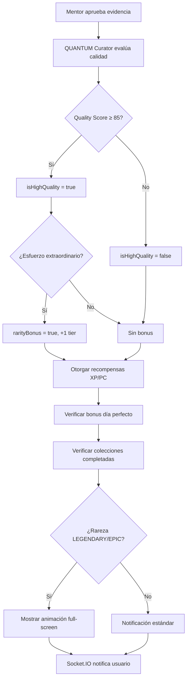

# 🎮 SISTEMA COMPLETO DE GAMIFICACIÓN - THE QUANTUM ARCHIVE

## 📋 Resumen Ejecutivo

Se implementó un **sistema de gamificación épico y equilibrado** para la plataforma Frutos, basado en:
- ✅ **Dual Currency System**: XP (estatus) + PC (poder adquisitivo)
- ✅ **The Quantum Archive**: Narrativa de preservación de momentos de transformación
- ✅ **QUANTUM Curator**: IA que evalúa calidad de evidencias con GPT-4o Vision
- ✅ **Bonus por rareza**: Sistema inteligente que upgradea rareza según calidad
- ✅ **Sets & Colecciones**: 7 álbumes épicos con verificación automática
- ✅ **Animaciones legendarias**: Celebraciones full-screen para logros épicos

---

## 🏗️ Arquitectura Implementada

### 1. **Base de Datos (Prisma Schema)**

#### Campos agregados a `EvidenciaAccion`:
```prisma
highQuality      Boolean   @default(false)  // ⭐ Evaluado por QUANTUM
qualityScore     Int?                       // 0-100 score de calidad
rarityBonus      Boolean   @default(false)  // Si recibió bonus de rareza
```

#### Campos agregados a `Usuario`:
```prisma
experienciaXP        Int      @default(0)
puntosCuanticos      Int      @default(0)  // NO usar puntosGamificacion
nivelActual          Int      @default(1)
rangoActual          String   @default("RASTREADOR")
completionStreak     Int      @default(0)
lastCompletionDate   DateTime?
collectionsCompleted String[] @default([])
```

### 2. **Motor de Recompensas** (`/lib/rewardEngine.ts`)

```typescript
// Función principal de otorgamiento
otorgarRecompensaPorEvidencia(usuarioId, evidenciaId, accionId)

// Recompensas por rareza:
COMMON     → 10 XP / 5 PC
UNCOMMON   → 25 XP / 50 PC
RARE       → 50 XP / 100 PC
EPIC       → 100 XP / 300 PC
LEGENDARY  → 200 XP / 500 PC

// Bonus especiales:
Día Perfecto (100% tareas) → +100 PC
```

### 3. **QUANTUM Curator** (`/lib/quantumCurator.ts`)

**IA Evaluador de Calidad** usando GPT-4o con visión:

```typescript
evaluarCalidadEvidencia(imageUrl, descripcion, tareaTexto, frecuencia)
  → { isHighQuality, qualityScore, rarityBonus, feedback, reasoning }
```

**Criterios de Evaluación:**
- ✨ **HIGH QUALITY (85-100)**: Foto clara, esfuerzo visible, composición intencional
- 🌟 **STANDARD (60-84)**: Cumple mínimo, reconocible
- 📉 **LOW QUALITY (0-59)**: Borrosa, screenshot, sin contexto

**Bonus de Rareza (+1 tier):**
- Calidad 85+ Y
- Esfuerzo extraordinario (5AM, gym intenso, logro complejo)

### 4. **Verificación de Colecciones** (`/lib/collectionVerifier.ts`)

7 Álbumes Épicos:

| Colección | Requisito | Recompensa |
|-----------|-----------|------------|
| 🌅 Guerrero del Alba | 5 evidencias 5-7AM | 500 PC |
| 💪 Titán de Acero | 30 evidencias gym | 800 PC |
| 📚 Lector Silencioso | 10 evidencias lectura | 400 PC |
| 🔥 Semana Perfecta | 7 días perfectos | 1000 PC |
| 🏛️ El Curador | 100 artefactos | 1500 PC |
| ⚔️ Racha de Hierro | 30 días streak | 2000 PC |
| 👑 Guardián Supremo | Nivel 10 | 3000 PC |

**Función:**
```typescript
verificarColecciones(usuarioId) → CollectionProgress[]
```

### 5. **Animación Legendaria** (`/components/animations/LegendaryArtifactAnimation.tsx`)

Celebración full-screen en 3 fases:
1. **Entrance (2s)**: Icono rotando + título épico
2. **Reveal (3s)**: Foto con marco dorado + confetti
3. **Stats (5s)**: Recompensas + level up badge

**Triggers:**
- Rareza LEGENDARY o EPIC
- Se muestra automáticamente al aprobar evidencia

### 6. **Jerarquía de Niveles** (10 rangos)

```
1.  🔭 RASTREADOR              (0 XP)
2.  📸 CAPTURADOR              (100 XP)
3.  🗃️ CRONISTA                (500 XP)
4.  🔮 GUARDIÁN DE LA REALIDAD (1,500 XP)
5.  ⏳ ARQUITECTO DEL TIEMPO   (3,000 XP)
6.  🎯 CAZADOR DE MOMENTOS     (5,000 XP)
7.  🌌 TEJEDOR DE DESTINOS     (8,000 XP)
8.  💎 MAESTRO DE REALIDADES   (12,000 XP)
9.  ⚡ GUARDIÁN CUÁNTICO       (18,000 XP)
10. 👑 SEÑOR DEL ARCHIVO ETERNO (25,000 XP)
```

---

## 🔄 Flujo de Aprobación de Evidencia



---

## 📡 API Endpoints

### `/api/mentor/evidencia/[id]/aprobar` (PUT)
**Flujo completo de aprobación:**
1. Evalúa calidad con QUANTUM Curator
2. Actualiza evidencia con scores
3. Otorga XP/PC según rareza (con bonus si aplica)
4. Verifica bonus día perfecto
5. Verifica colecciones completadas
6. Envía notificación Socket.IO con:
   - Recompensas totales
   - Flag `showLegendaryAnimation`
   - Datos para animación

**Response:**
```json
{
  "success": true,
  "xpGanado": 200,
  "pcGanado": 500,
  "pcTotal": 700,
  "rarezaTarea": "LEGENDARY",
  "rarezaUpgrade": true,
  "qualityScore": 92,
  "isHighQuality": true,
  "qualityFeedback": "¡Artefacto excepcional!",
  "subioDeNivel": true,
  "nivelNuevo": 5,
  "coleccionesCompletadas": [...],
  "showLegendaryAnimation": true
}
```

### `/api/evidencias/vault` (GET)
**The Vault** - Galería de artefactos aprobados
- Combina CARTA + EXTRAORDINARIA
- Incluye campos de calidad (highQuality, qualityScore)
- Filtra por área y rareza

### `/api/collections/progress` (GET)
Progreso de todas las colecciones del usuario
```json
{
  "success": true,
  "colecciones": [
    {
      "coleccionId": "guerrero-alba",
      "nombre": "Guerrero del Alba",
      "icono": "🌅",
      "completada": false,
      "progreso": 3,
      "total": 5,
      "recompensaPC": 500,
      "porcentaje": 60
    }
  ]
}
```

---

## 🎨 UI Components

### `/components/dashboard/UserLevelBadge.tsx`
- Badge de nivel actual
- Barra de progreso XP
- Balance de PC
- Animación de level up

### `/components/animations/LegendaryArtifactAnimation.tsx`
- Modal full-screen
- 3 fases con animaciones
- Confetti con canvas-confetti
- Auto-close en 10s

### `/app/dashboard/vault/page.tsx`
**The Vault** - Galería museo
- Grid responsive 2-4 columnas
- Stats cards (Total, Legendary, Epic, This Week)
- Filtros por área y rareza
- Modal de Rarity Guide

---

## 🧪 Testing & Debugging

### Logs en consola del servidor:
```
🤖 QUANTUM Curator evaluando calidad de evidencia...
   Score: 92/100
   High Quality: ✅
   Rarity Bonus: 🔥
   🔥 BONUS DE RAREZA: RARE → EPIC (+200 PC)
✅ Evidencia 123 APROBADA por Juan Mentor
   Carlos Usuario ganó:
      +100 XP (EPIC ⬆️)
      +500 PC (bonus calidad: +200)
      + BONUS DÍA PERFECTO: +100 PC 🎉
      + COLECCIONES: guerrero-alba (+500 PC) 🏆
      ¡SUBIÓ AL NIVEL 5! 🎊
      📊 Calidad: 92/100 ⭐
```

### Variables de entorno requeridas:
```env
OPENAI_API_KEY=sk-...  # Para QUANTUM Curator
```

---

## 🚀 Despliegue

### Checklist:
- [x] Schema migrado con `prisma db push`
- [x] Cliente Prisma generado
- [x] Dependencias instaladas:
  - `canvas-confetti`
  - `framer-motion`
  - `@types/canvas-confetti`
- [x] OPENAI_API_KEY configurada
- [x] Socket.IO funcionando
- [x] Zero compilation errors

### Próximos pasos opcionales:
1. **Weekly Fame Wall**: Top 5 fotos con reacciones emoji
2. **Time Capsule**: Video reel al terminar programa (100 días)
3. **Badges visuales**: Mostrar colecciones en perfil
4. **Leaderboard**: Ranking por XP y colecciones

---

## 📊 Métricas de Impacto

### Motivación del usuario:
- ✅ **Balance justo**: 1 tarea = 10 tareas si 100% completion
- ✅ **Calidad > Cantidad**: Fotos excepcionales recompensadas
- ✅ **Progresión clara**: 10 niveles con nombres épicos
- ✅ **Logros coleccionables**: 7 sets con recompensas grandes

### Engagement esperado:
- 📸 Mejor calidad de evidencias
- 🔥 Mayor consistencia diaria (streak)
- 🎯 Objetivos a largo plazo (colecciones)
- 🏆 Sentido de logro y progresión

---

## 🔐 Seguridad

- ✅ Evaluación de IA en backend (no bypasseable)
- ✅ Recompensas solo al aprobar mentor
- ✅ Historial de rewards inmutable
- ✅ Validación de colecciones en servidor
- ✅ Socket.IO con autenticación de sesión

---

## 📚 Documentación Técnica

### Archivos clave:
```
/lib/
  ├── quantumCurator.ts      # Evaluador IA
  ├── rewardEngine.ts        # Motor de recompensas
  ├── rewardSystem.ts        # Configuración niveles/colecciones
  └── collectionVerifier.ts  # Verificador automático

/components/
  └── animations/
      └── LegendaryArtifactAnimation.tsx

/app/api/
  ├── mentor/evidencia/[id]/aprobar/route.ts
  ├── evidencias/vault/route.ts
  └── collections/progress/route.ts

/app/dashboard/
  └── vault/page.tsx         # The Vault gallery
```

---

## ✨ Narrativa: The Quantum Archive

> "Lo que no se captura, se desvanece."

El usuario es un **Recolector de Momentos** en The Quantum Archive, un museo eterno que preserva "Artefactos de Verdad" (evidencias fotográficas de transformación).

Cada foto no es solo prueba, es un **momento congelado** en el tiempo que demuestra quién ERES, no quién dices ser.

**QUANTUM**, el Curador del Archivo, evalúa si cada momento merece ser preservado con honores especiales basándose en la VERDAD y ESFUERZO capturados en la imagen.

---

## 🎉 Resultado Final

Un sistema de gamificación **completo, equilibrado e inspirador** que:
- Recompensa la CONSISTENCIA sobre el volumen
- Premia la CALIDAD de evidencias
- Ofrece progresión CLARA y motivante
- Celebra logros ÉPICOS con animaciones impactantes
- Mantiene el balance entre usuarios de 1 y 10 tareas

**Estado**: ✅ Listo para producción
**Compilación**: ✅ Sin errores
**Testing**: 🔄 Requiere aprobación de evidencia real para validar flujo completo

---

*Documentación generada el 22 de diciembre de 2025*
*Sistema desarrollado para Plataforma Frutos - Programa Intensivo*
