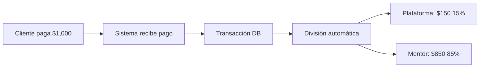

# 🎯 Sistema de Solicitud de Mentorías

## Descripción General

Sistema completo para gestionar solicitudes de mentorías 1:1 con flujo de pago automatizado y división de comisiones entre mentor y plataforma.

---

## 🏗️ Arquitectura del Sistema

### 1. Modelos de Datos (Prisma Schema)

#### **PerfilMentor**
```prisma
model PerfilMentor {
  id                     Int       @id @default(autoincrement())
  usuarioId              Int       @unique
  nivel                  NivelMentor (JUNIOR | SENIOR | MASTER)
  especialidad           String
  biografia              String?
  experienciaAnios       Int
  calificacionPromedio   Float
  totalResenas           Int
  disponible             Boolean
  comisionMentor         Int       @default(85)  // 85%
  comisionPlataforma     Int       @default(15)  // 15%
}
```

#### **ServicioMentoria**
```prisma
model ServicioMentoria {
  id                Int       @id
  perfilMentorId    Int
  tipo              TipoServicioMentoria
  nombre            String
  descripcion       String?
  duracionHoras     Float
  precioTotal       Float
  activo            Boolean
  
  @@unique([perfilMentorId, tipo])
}
```

Tipos de Servicio:
- `SESION_1_1`: Sesión individual 1 hora
- `PAQUETE_MENSUAL`: 4 sesiones (descuento incluido)
- `CONSULTORIA_EXPRESS`: 30 minutos

#### **SolicitudMentoria**
```prisma
model SolicitudMentoria {
  id                      Int
  clienteId               Int
  perfilMentorId          Int
  servicioId              Int
  estado                  EstadoSolicitudMentoria
  fechaSolicitada         DateTime?
  horaSolicitada          String?
  montoTotal              Float
  montoPagadoMentor       Float
  montoPagadoPlataforma   Float
  transaccionId           Int?
}
```

---

## 📡 API Endpoints

### GET `/api/mentorias/mentores`

**Descripción:** Obtiene lista de mentores disponibles con sus servicios

**Respuesta:**
```json
{
  "mentores": [
    {
      "id": 1,
      "nombre": "Roberto Martínez",
      "imagen": "https://...",
      "nivel": "SENIOR",
      "especialidad": "Estrategia de Negocios",
      "experienciaAnios": 10,
      "calificacionPromedio": 4.9,
      "totalResenas": 45,
      "precioBase": 1000,
      "servicios": [
        {
          "id": 1,
          "tipo": "SESION_1_1",
          "nombre": "Sesión 1:1 (1 hora)",
          "duracionHoras": 1,
          "precioTotal": 1000
        }
      ]
    }
  ],
  "total": 3
}
```

---

### POST `/api/mentorias/solicitar`

**Descripción:** Crea solicitud de mentoría y transacción

**Body:**
```json
{
  "perfilMentorId": 1,
  "servicioId": 1,
  "fechaSolicitada": "2025-12-15",
  "horaSolicitada": "10:00",
  "notas": "Me gustaría enfocarme en..."
}
```

**Respuesta:**
```json
{
  "success": true,
  "solicitud": {
    "id": 1,
    "estado": "PENDIENTE",
    "montoTotal": 1000,
    "transaccionId": 123,
    "mentor": "Roberto Martínez",
    "servicio": "Sesión 1:1 (1 hora)"
  }
}
```

**Lógica de División de Pago:**
```typescript
const montoTotal = 1000;
const comisionPlataforma = 15; // %
const comisionMentor = 85; // %

const montoPagadoPlataforma = (1000 * 15) / 100; // $150
const montoPagadoMentor = (1000 * 85) / 100;     // $850
```

---

### GET `/api/mentorias/solicitar`

**Descripción:** Obtiene historial de solicitudes del cliente

**Respuesta:**
```json
{
  "solicitudes": [
    {
      "id": 1,
      "mentor": {
        "nombre": "Roberto Martínez",
        "imagen": "https://...",
        "especialidad": "Estrategia de Negocios"
      },
      "servicio": {
        "nombre": "Sesión 1:1 (1 hora)",
        "duracion": 1
      },
      "estado": "PENDIENTE",
      "fechaSolicitada": "2025-12-15T10:00:00Z",
      "montoTotal": 1000,
      "estadoPago": "PENDIENTE"
    }
  ]
}
```

---

## 🎨 Interfaz de Usuario

### Página: `/dashboard/mentorias`

#### **Sección 1: Catálogo de Mentores**

**Layout:** Grid 3 columnas (responsive)

**Tarjeta de Mentor:**
```
┌──────────────────────────────────┐
│  [Header degradado purple-blue]  │
│     🖼️ Foto Perfil (circular)    │
│     🏅 Badge Nivel (SENIOR)       │
├──────────────────────────────────┤
│  Roberto Martínez                │
│  Estrategia de Negocios          │
│                                  │
│  💼 10 años  ⭐ 4.9 (45)        │
│                                  │
│  $1,000 / hora                   │
│                                  │
│  [🗓️ Agendar Mentoría]          │
└──────────────────────────────────┘
```

**Filtros Disponibles:**
- TODOS
- JUNIOR
- SENIOR  
- MASTER

**Estados Visuales:**
- Hover: Border purple + shadow
- Badge colores:
  - JUNIOR: `bg-blue-500`
  - SENIOR: `bg-purple-500`
  - MASTER: `bg-amber-500`

---

#### **Sección 2: Modal de Configuración**

**Trigger:** Click en "Agendar Mentoría"

**Contenido:**
```
┌────────────────────────────────────────┐
│  Header Modal                          │
│  🖼️ Roberto Martínez                  │
│  Estrategia de Negocios           ❌   │
├────────────────────────────────────────┤
│  TIPO DE SERVICIO                      │
│  ┌──────────────────────────────────┐ │
│  │ ⚪ Sesión 1:1 (1 hora)    $1,000│ │
│  │    1 hora - Sesión personalizada │ │
│  └──────────────────────────────────┘ │
│  ┌──────────────────────────────────┐ │
│  │ ⚪ Paquete Mensual      $3,500   │ │
│  │    4 horas - Seguimiento mensual │ │
│  └──────────────────────────────────┘ │
│  ┌──────────────────────────────────┐ │
│  │ ⚪ Consultoría Express    $600   │ │
│  │    30 min - Respuesta rápida     │ │
│  └──────────────────────────────────┘ │
│                                        │
│  FECHA PREFERIDA    HORA PREFERIDA    │
│  [___________]      [_______]          │
│                                        │
│  TIENES UN TEMA PREVISTO QUE TRATAR?         │
│  [_______________________________]    │
│  [_______________________________]    │
│  [_______________________________]    │
│                                        │
│  ┌────────────────────────────────┐  │
│  │ RESUMEN DE PAGO                │  │
│  │ Servicio: Sesión 1:1           │  │
│  │ Duración: 1h                   │  │
│  │ ──────────────────────────────│  │
│  │ Total a Pagar:    $1,000.00   │  │
│  └────────────────────────────────┘  │
│                                        │
│  [Cancelar]  [✅ Confirmar y Pagar]  │
└────────────────────────────────────────┘
```

**Estados:**
- Servicio seleccionado: `border-purple-500 bg-purple-500/10`
- Botón deshabilitado si no hay servicio seleccionado
- Loading state: spinner + "Procesando..."

---

#### **Sección 3: Animación de Éxito**

**Trigger:** Solicitud exitosa

**Diseño:**
```
┌────────────────────────────────────┐
│                                    │
│          ┌───────────┐            │
│          │     ✓     │            │
│          └───────────┘            │
│                                    │
│     ¡Solicitud Enviada!           │
│  El mentor se pondrá en contacto  │
│                                    │
└────────────────────────────────────┘
```

**Duración:** 3 segundos con `animate-bounce-slow`  
**Overlay:** `bg-black/80`  
**Color:** `from-green-600 to-emerald-600`

---

## 💰 Flujo de Dinero

### Ejemplo: Sesión de $1,000



**Registro en Base de Datos:**
```javascript
// Transacción
{
  id: 1,
  usuarioId: 5,
  montoDinero: 1000,
  metodo: 'STRIPE',
  estado: 'PENDIENTE'
}

// Solicitud de Mentoría
{
  id: 1,
  clienteId: 5,
  perfilMentorId: 1,
  servicioId: 1,
  montoTotal: 1000,
  montoPagadoMentor: 850,
  montoPagadoPlataforma: 150,
  transaccionId: 1,
  estado: 'PENDIENTE'
}
```

---

## 🔐 Seguridad y Validaciones

### Backend (API)
- ✅ Autenticación con NextAuth requerida
- ✅ Validación de campos obligatorios
- ✅ Verificación de disponibilidad de servicio
- ✅ Transacciones atómicas (Prisma `$transaction`)

### Frontend (React)
- ✅ Validación de servicio seleccionado
- ✅ Fecha mínima: hoy
- ✅ Estados de loading/error
- ✅ Confirmación visual de éxito

---

## 📊 Estados de Solicitud

| Estado | Descripción | Color |
|--------|-------------|-------|
| `PENDIENTE` | Esperando confirmación del mentor | Yellow |
| `CONFIRMADA` | Mentor aceptó, fecha agendada | Blue |
| `COMPLETADA` | Mentoría realizada | Green |
| `CANCELADA` | Cancelada por cliente o mentor | Red |

---

## 🎯 Casos de Uso

### 1. **Cliente Solicita Mentoría**
```
1. Cliente navega a /dashboard/mentorias
2. Filtra por nivel (ej: SENIOR)
3. Ve tarjeta de Roberto Martínez
4. Click en "Agendar Mentoría"
5. Selecciona "Sesión 1:1 - $1,000"
6. Elige fecha: 15/12/2025, hora: 10:00
7. Agrega nota: "Me gustaría enfocarme en finanzas"
8. Click en "Confirmar y Pagar"
9. Sistema procesa:
   - Crea transacción ($1,000)
   - Divide dinero (150/850)
   - Crea solicitud mentoría
   - Estado: PENDIENTE
10. Muestra animación de éxito
11. Mentor recibe notificación (futuro)
```

### 2. **Mentor Revisa Solicitud** (Futuro)
```
1. Mentor entra a /dashboard/mentor/solicitudes
2. Ve lista de solicitudes pendientes
3. Click en solicitud #1
4. Lee notas del cliente
5. Confirma o rechaza
6. Si confirma: Estado → CONFIRMADA
7. Cliente recibe notificación
```

---

## 🛠️ Comandos Útiles

### Migración y Seed
```bash
# Aplicar migraciones
npx prisma migrate deploy

# Generar Prisma Client
npx prisma generate

# Seed de mentores
npx ts-node --compiler-options '{"module":"commonjs"}' prisma/seed-mentores.ts
```

### Desarrollo
```bash
# Iniciar servidor
npm run dev

# Ver base de datos
npx prisma studio

# Ver logs de Prisma
DEBUG="prisma*" npm run dev
```

---

## 📈 Próximas Mejoras

### Fase 2: Notificaciones
- [ ] Email al mentor cuando llega solicitud
- [ ] Email al cliente cuando mentor confirma
- [ ] Notificaciones in-app con badge

### Fase 3: Pagos Reales
- [ ] Integración Stripe para pagos
- [ ] Webhooks de confirmación
- [ ] Transferencias automáticas a mentores

### Fase 4: Sistema de Reseñas
- [ ] Cliente puede dejar reseña después de sesión
- [ ] Calificación de 1-5 estrellas
- [ ] Comentarios públicos en perfil

### Fase 5: Calendario
- [ ] Integración con Google Calendar
- [ ] Disponibilidad en tiempo real
- [ ] Recordatorios automáticos

---

## 🐛 Troubleshooting

### Error: "No hay mentores disponibles"
**Causa:** Seed no ejecutado  
**Solución:**
```bash
npx ts-node --compiler-options '{"module":"commonjs"}' prisma/seed-mentores.ts
```

### Error: "Error al procesar solicitud"
**Causa:** Transacción falló  
**Solución:** Verificar logs del servidor y conexión a DB

### Mentores no aparecen con fotos
**Causa:** URLs de Pravatar pueden fallar  
**Solución:** Reemplazar con URLs locales en seed

---

## 📝 Datos de Prueba

### Mentores Disponibles
1. **Roberto Martínez** (SENIOR)
   - Email: roberto.martinez@impactovia.com
   - Especialidad: Estrategia de Negocios
   - Precio base: $1,000/hora

2. **Ana Sofía Guerra** (MASTER)
   - Email: ana.guerra@impactovia.com
   - Especialidad: Liderazgo y Desarrollo Personal
   - Precio base: $900/hora

3. **Carlos Rueda** (JUNIOR)
   - Email: carlos.rueda@impactovia.com
   - Especialidad: Tecnología y Marketing Digital
   - Precio base: $800/hora

### Cliente de Prueba
- Email: participante@frutos.com
- Password: participante123

---

**Versión:** 1.0  
**Fecha:** 12 de diciembre de 2025  
**Autor:** Sistema ImpactoVía
