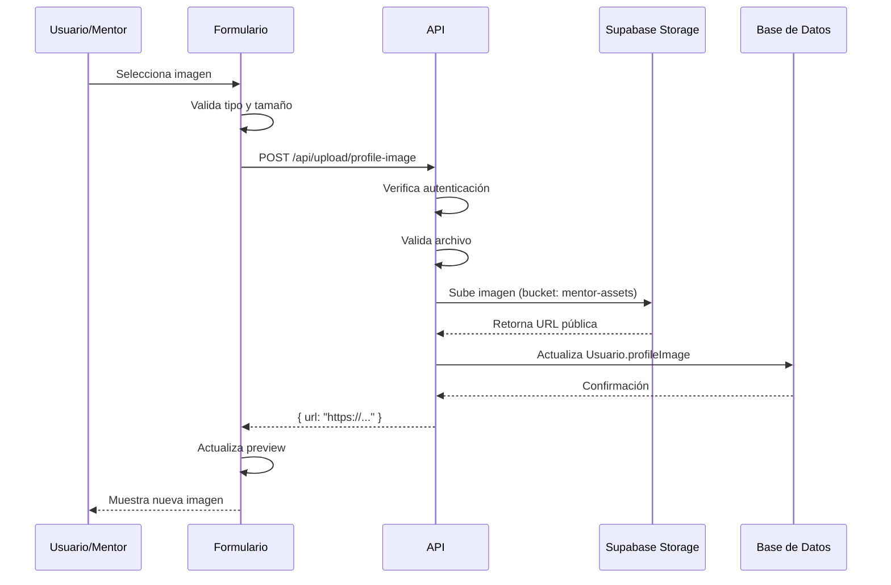

# Sistema de Carga de Imágenes de Perfil

## 📸 Descripción

Sistema completo para que los mentores puedan **subir fotografías de perfil** directamente desde el formulario, en lugar de solo usar URLs.

## ✨ Características

- ✅ Subida de archivos desde dispositivo
- ✅ Validación de tipo de archivo (solo imágenes)
- ✅ Validación de tamaño (máx. 5MB)
- ✅ Almacenamiento en Supabase Storage
- ✅ URLs públicas automáticas
- ✅ Actualización automática del perfil
- ✅ Fallback a URL manual

## 🏗️ Arquitectura

```
┌─────────────────────┐
│  Formulario Mentor  │
│   (Frontend)        │
│  - Input file       │
│  - Preview imagen   │
└──────────┬──────────┘
           │
           │ POST FormData
           ▼
┌─────────────────────────────┐
│  /api/upload/profile-image  │
│  - Valida autenticación     │
│  - Valida archivo           │
│  - Sube a Supabase Storage  │
│  - Actualiza BD             │
└──────────┬──────────────────┘
           │
           │ URL pública
           ▼
┌─────────────────────┐
│  Supabase Storage   │
│  Bucket:            │
│  mentor-assets/     │
│  profile-images/    │
└─────────────────────┘
```

## 📁 Archivos Creados

### 1. **Frontend: Formulario con Upload**
`app/dashboard/mentor/perfil/page.tsx`

**Cambios:**
- Agregado estado `uploadingImage`
- Función `handleImageUpload()` para manejar la subida
- Input file oculto con botón personalizado
- Preview en tiempo real
- Mantiene opción de URL manual

**UI:**
```tsx
<label htmlFor="imageUpload" className="...">
  {uploadingImage ? (
    <>
      <Loader2 className="animate-spin" />
      Subiendo...
    </>
  ) : (
    <>
      <User />
      Subir Imagen
    </>
  )}
</label>
```

### 2. **Backend: API de Upload**
`app/api/upload/profile-image/route.ts`

**Proceso:**
1. Verifica autenticación con NextAuth
2. Valida tipo de archivo (`image/*`)
3. Valida tamaño (5MB máximo)
4. Genera nombre único: `{userId}-{timestamp}.{ext}`
5. Sube a Supabase Storage
6. Obtiene URL pública
7. Actualiza campo `profileImage` en tabla `Usuario`

**Seguridad:**
- Solo usuarios autenticados pueden subir
- Validación de tipo MIME
- Validación de tamaño
- Nombres únicos previenen sobrescritura

### 3. **Script de Configuración**
`scripts/setup-storage-bucket.js`

Crea el bucket `mentor-assets` en Supabase con configuración adecuada.

## 🔧 Configuración de Supabase Storage

### Paso 1: Crear Bucket

1. Ve a tu proyecto en **Supabase Dashboard**
2. Ve a **Storage** en el menú lateral
3. Click en **New Bucket**
4. Nombre: `mentor-assets`
5. Selecciona: **Public bucket** ✅
6. Click **Create**

### Paso 2: Configurar Políticas de Seguridad (RLS)

En el bucket `mentor-assets`, ve a **Policies** y crea estas políticas:

#### 📖 **Lectura Pública** (SELECT)
```sql
-- Nombre: Public read access
-- Operation: SELECT
-- Target roles: public

CREATE POLICY "Public read access"
ON storage.objects FOR SELECT
TO public
USING (bucket_id = 'mentor-assets');
```

#### 📤 **Subida para Autenticados** (INSERT)
```sql
-- Nombre: Authenticated users can upload
-- Operation: INSERT
-- Target roles: authenticated

CREATE POLICY "Authenticated users can upload"
ON storage.objects FOR INSERT
TO authenticated
WITH CHECK (bucket_id = 'mentor-assets');
```

#### ✏️ **Actualización Propia** (UPDATE)
```sql
-- Nombre: Users can update their own files
-- Operation: UPDATE
-- Target roles: authenticated

CREATE POLICY "Users can update their own files"
ON storage.objects FOR UPDATE
TO authenticated
USING (
  bucket_id = 'mentor-assets' AND
  (storage.foldername(name))[1] = auth.uid()::text
);
```

#### 🗑️ **Eliminación Propia** (DELETE)
```sql
-- Nombre: Users can delete their own files
-- Operation: DELETE
-- Target roles: authenticated

CREATE POLICY "Users can delete their own files"
ON storage.objects FOR DELETE
TO authenticated
USING (
  bucket_id = 'mentor-assets' AND
  (storage.foldername(name))[1] = auth.uid()::text
);
```

### Paso 3: Configurar Variables de Entorno

Asegúrate de que tu `.env` tenga:

```bash
# Supabase (ya deberías tenerlas)
NEXT_PUBLIC_SUPABASE_URL=https://tu-proyecto.supabase.co
NEXT_PUBLIC_SUPABASE_ANON_KEY=tu-anon-key
SUPABASE_SERVICE_ROLE_KEY=tu-service-role-key
```

## 🚀 Uso

### Desde la UI del Mentor

1. Ve a `/dashboard/mentor/perfil`
2. Sección **"Identidad y Foto"**
3. Click en **"Subir Imagen"**
4. Selecciona una imagen de tu dispositivo
5. Espera a que se suba
6. ¡Listo! La imagen se muestra automáticamente

### Validaciones

| Validación | Límite | Mensaje de Error |
|------------|--------|------------------|
| Tipo de archivo | Solo imágenes (JPG, PNG, GIF, WebP) | "Por favor selecciona un archivo de imagen válido" |
| Tamaño | Máximo 5MB | "La imagen no puede superar los 5MB" |
| Autenticación | Usuario logueado | "No autenticado" |

## 📊 Estructura de Almacenamiento

```
mentor-assets/
└── profile-images/
    ├── 7-1734912345678.jpg     ← Usuario ID 7
    ├── 7-1734912456789.png     ← Nueva foto del mismo usuario
    ├── 15-1734912567890.jpg    ← Usuario ID 15
    └── 23-1734912678901.webp   ← Usuario ID 23
```

**Naming Convention:**
- `{userId}-{timestamp}.{extension}`
- Ejemplo: `7-1734912345678.jpg`
- Timestamp en milisegundos para unicidad

## 🔄 Flujo Completo



## 🧪 Testing

### Probar Subida Exitosa

1. Login como mentor
2. Ve a perfil
3. Sube imagen válida (JPG, < 5MB)
4. Verifica que aparece en el preview
5. Guarda el formulario
6. Recarga la página
7. La imagen debe persistir

### Probar Validaciones

**Archivo muy grande:**
- Intenta subir imagen > 5MB
- Debe mostrar: "La imagen no puede superar los 5MB"

**Archivo no válido:**
- Intenta subir PDF o documento
- Debe mostrar: "Por favor selecciona un archivo de imagen válido"

**Sin autenticación:**
- Intenta acceder a `/api/upload/profile-image` sin login
- Debe retornar 401 Unauthorized

## 🐛 Troubleshooting

### Error: "Cannot find module '@supabase/supabase-js'"

**Solución:**
```bash
npm install @supabase/supabase-js
```

### Error: "Bucket 'mentor-assets' not found"

**Solución:**
1. Ve a Supabase Dashboard → Storage
2. Crea el bucket `mentor-assets`
3. Marca como **público**

### Error: "Row Level Security policy violation"

**Solución:**
1. Ve a Storage → mentor-assets → Policies
2. Crea las 4 políticas descritas arriba
3. Asegúrate de que estén **habilitadas**

### La imagen no se muestra

**Posibles causas:**
1. Bucket no es público → Marca como público
2. URL incorrecta → Verifica en BD el campo `profileImage`
3. CORS bloqueado → Supabase Storage maneja CORS automáticamente

### Imagen se sube pero no se ve en el formulario

**Solución:**
1. Verifica que `setFormData` actualice `profileImage`
2. Revisa la consola del navegador por errores
3. Confirma que `formData.profileImage` tiene la URL correcta

## 🔐 Seguridad

### ✅ Implementado

- Autenticación requerida (NextAuth)
- Validación de tipo de archivo (MIME type)
- Validación de tamaño (5MB)
- Nombres únicos para evitar conflictos
- RLS policies en Supabase
- Solo el usuario puede actualizar/eliminar sus archivos

### 🚨 Consideraciones

- **Spam:** No hay límite de subidas por usuario
  - **Mejora futura:** Rate limiting
- **Imágenes antiguas:** No se eliminan automáticamente
  - **Mejora futura:** Cleanup job para imágenes huérfanas
- **Contenido inapropiado:** No hay moderación automática
  - **Mejora futura:** Integración con servicio de moderación de imágenes

## 🎨 UI/UX

### Mejoras Implementadas

- ✅ Botón con estado de carga (spinner)
- ✅ Preview inmediato al subir
- ✅ Fallback a URL manual
- ✅ Validación con mensajes claros
- ✅ Diseño consistente con el resto del formulario

### Posibles Mejoras Futuras

- 🔮 Crop/resize de imagen antes de subir
- 🔮 Drag & drop para subir
- 🔮 Múltiples imágenes (galería de mentor)
- 🔮 Optimización automática de tamaño
- 🔮 Filtros/efectos de imagen

## 📦 Dependencias

```json
{
  "@supabase/supabase-js": "^2.x.x",
  "next": "15.0.3",
  "next-auth": "^4.x.x",
  "@prisma/client": "5.22.0"
}
```

## 🚀 Deploy

### Vercel

Asegúrate de agregar las variables de entorno:

```bash
NEXT_PUBLIC_SUPABASE_URL=...
NEXT_PUBLIC_SUPABASE_ANON_KEY=...
SUPABASE_SERVICE_ROLE_KEY=...
```

### Supabase

1. Crea el bucket `mentor-assets`
2. Configura las 4 políticas RLS
3. Marca el bucket como público

## 📝 Notas

- Las imágenes se almacenan en `mentor-assets/profile-images/`
- Las URLs son públicas y accesibles sin autenticación
- El sistema actualiza automáticamente la BD al subir
- Compatible con el Quantum Bio-Writer (la imagen persiste al regenerar biografía)

---

**Sistema implementado:** 23 de diciembre de 2025  
**Autor:** GitHub Copilot  
**Status:** ✅ Funcional - Pendiente configuración de Supabase Storage
