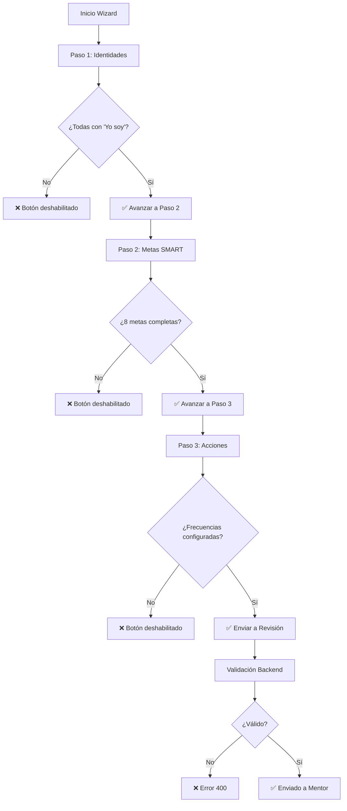

# 🎯 SISTEMA DE VALIDACIÓN DURA - CARTA F.R.U.T.O.S.

## 📋 Resumen Ejecutivo

Se implementó un sistema completo de validación con **reglas de negocio duras** que se aplican tanto en Frontend (UX) como en Backend (seguridad). El wizard ahora **bloquea el avance** hasta que cada paso esté completamente validado.

---

## 🔒 Reglas de Negocio Implementadas

### 1️⃣ Validación "Yo Soy" (Paso 1)

**Regla**: Toda declaración de identidad DEBE iniciar con "Yo soy" o "Soy"

**Implementación**:
```typescript
// lib/validaciones-carta.ts
export function validateYoSoy(text: string): boolean {
  const normalized = text.trim().toLowerCase();
  return normalized.startsWith('yo soy') || normalized.startsWith('soy');
}
```

**Comportamiento UI**:
- ✅ Feedback visual en tiempo real (borde verde/rojo)
- ✅ Checkmark verde cuando es válido
- ❌ Mensaje de error: "Debe iniciar con 'Yo soy' o 'Soy'"
- 🚫 **Botón "Siguiente" deshabilitado** hasta completar las 8 áreas

---

### 2️⃣ Integridad de Áreas (8 Obligatorias)

**Regla**: Deben existir las 8 áreas: FINANZAS, RELACIONES, SALUD, TALENTOS, PAZ_MENTAL, DIVERSIÓN, COMUNIDAD, ENROLAMIENTO

**Implementación**:
```typescript
export const AREAS_OBLIGATORIAS = [
  'FINANZAS', 'RELACIONES', 'SALUD', 'TALENTOS',
  'PAZ_MENTAL', 'DIVERSION', 'COMUNIDAD', 'ENROLAMIENTO'
] as const;
```

**Validación**: Se verifica en backend antes de aceptar el submit

---

### 3️⃣ Metas SMART Obligatorias (Paso 2)

**Regla**: Cada área debe tener al menos 1 meta definida

**Comportamiento UI**:
- 📊 Panel de advertencia muestra áreas sin meta
- 🚫 **Botón "Siguiente" deshabilitado** hasta completar las 8 metas
- ✅ Indicadores visuales de progreso (3 dots en footer)

---

### 4️⃣ Configuración de Acciones (Paso 3)

**Regla**: Cada meta debe tener al menos 1 acción con frecuencia configurada

**Validaciones por frecuencia**:

| Frecuencia | Validación Requerida | Tareas Estimadas |
|------------|---------------------|------------------|
| DAILY | Automático (7 días) | ~100 |
| WEEKLY | Mínimo 1 día seleccionado | Variable |
| BIWEEKLY | Mínimo 1 día seleccionado | ~7 |
| MONTHLY | Día del mes requerido | ~3 |

**Comportamiento UI**:
- ⚠️ Advertencia especial para DAILY (100 evidencias)
- 📊 Contador de tareas totales estimadas
- 🚫 **Botón "Enviar" deshabilitado** hasta completar configuración

---

## 🎨 Componentes Actualizados

### 1. CartaWizard.tsx

**Nuevas funciones de validación**:
```typescript
validateYoSoy(text: string)        // Valida "Yo soy"
validateStep1()                     // Todas las identidades válidas
validateStep2()                     // Todas las metas completas
validateStep3()                     // Todas las acciones configuradas
canAdvanceToStep2()                 // Permite avanzar de 1 → 2
canAdvanceToStep3()                 // Permite avanzar de 2 → 3
canSubmit()                         // Permite envío final
```

**Características visuales**:
- ✅ Validación en tiempo real con feedback inmediato
- ✅ Bordes verdes/rojos según validez
- ✅ Checkmarks y íconos de advertencia
- ✅ Paneles de error contextuales
- ✅ Indicadores de progreso (3 dots en footer)
- ✅ Botones deshabilitados inteligentemente

---

### 2. ConfiguradorAccion.tsx

**Mejoras**:
- ✅ Selector visual de frecuencia con tarjetas
- ✅ Advertencia especial para DAILY
- ✅ Contador de tareas estimadas
- ✅ Selector de días con checkmarks animados
- ✅ Resumen final del compromiso

---

### 3. lib/validaciones-carta.ts (NUEVO)

**Archivo compartido Frontend/Backend** con:

```typescript
// Validadores individuales
validateYoSoy(text)
validateAreasIntegrity(carta)
validateAllIdentities(carta)
validateAllMetas(carta)
validateAcciones(metas)

// Validador maestro
validateCartaCompleta(carta, metas) 
// Returns: { valid, step, errors }

// Validador para backend (lanza excepciones)
validateCartaForSubmission(carta, metas)
```

---

## 🔐 Validación Backend

### app/api/carta/submit/route.ts

**ANTES**:
```typescript
// No había validación, aceptaba cualquier cosa
```

**AHORA**:
```typescript
// ========== VALIDACIÓN DURA ==========
try {
  validateCartaForSubmission(carta, carta.Meta);
} catch (validationError: any) {
  return NextResponse.json({ 
    error: 'Validación fallida', 
    message: validationError.message,
    hint: 'Completa todos los campos requeridos'
  }, { status: 400 });
}
```

**Resultado**: Imposible enviar carta incompleta, incluso manipulando el fetch

---

## 🎯 Flujo de Usuario



---

## 📊 Indicadores Visuales

### Footer del Wizard

```
┌──────────────────────────────────────────┐
│  [ ← Anterior ]    Paso 2 de 3    [ Siguiente → ]   │
│                    ● ● ○                 │
│                  ↑Verde si válido        │
└──────────────────────────────────────────┘
```

### Paneles de Advertencia

**Paso 1 - Identidades Inválidas**:
```
⚠️ Atención: Validación de Identidad
Todas las declaraciones DEBEN iniciar con "Yo Soy"

✗ 💰 FINANZAS
✗ 🎨 TALENTOS
```

**Paso 2 - Metas Faltantes**:
```
⚠️ Metas Incompletas
Todas las áreas deben tener 1 meta SMART

✗ ❤️ RELACIONES
✗ 🌟 ENROLAMIENTO
```

**Paso 3 - Acciones Sin Configurar**:
```
⚠️ Configuración de Acciones Pendiente
Cada área debe tener 1 acción con frecuencia
```

---

## 🧪 Testing Manual

### ✅ Test 1: Validación "Yo Soy"
1. Abrir wizard → Paso 1
2. Escribir "soy abundante" → ✅ Verde
3. Escribir "Abundancia" → ❌ Rojo con mensaje
4. Intentar avanzar → 🚫 Botón deshabilitado
5. Corregir con "Yo soy abundancia" → ✅ Verde
6. Completar 8 áreas → Botón "Siguiente" se habilita

### ✅ Test 2: Bloqueo de Pasos
1. Iniciar wizard con carta vacía
2. Intentar saltar a Paso 2 → **No permitido**
3. Completar Paso 1 → Paso 2 se desbloquea
4. Intentar saltar a Paso 3 → **No permitido**
5. Completar Paso 2 → Paso 3 se desbloquea

### ✅ Test 3: Validación Backend
1. Abrir DevTools → Console
2. Ejecutar:
```javascript
fetch('/api/carta/submit', {
  method: 'POST',
  body: JSON.stringify({ cartaId: 1 })
})
```
3. Resultado esperado: **400 Bad Request** con mensaje de validación

### ✅ Test 4: Frecuencia DAILY
1. Ir a Paso 3
2. Seleccionar DAILY
3. Ver advertencia naranja: "100 evidencias diarias"
4. Cambiar a WEEKLY → Advertencia desaparece

---

## 📝 Mensajes de Error Mejorados

### Frontend (Alert)
```
❌ Debes completar todas las declaraciones de identidad 
   con "Yo Soy" antes de continuar.
```

### Backend (400 Response)
```json
{
  "error": "Validación fallida",
  "message": "Validación fallida en Paso 1: FINANZAS: Debe iniciar con 'Yo soy'; SALUD: Declaración vacía",
  "hint": "Completa todos los campos requeridos en los 3 pasos del wizard"
}
```

---

## 🚀 Próximos Pasos Recomendados

### Corto Plazo
- [ ] Integrar guardado de acciones en Paso 3
- [ ] Agregar preview antes de enviar
- [ ] Toast notifications en lugar de alerts

### Mediano Plazo
- [ ] Validación SMART de metas (específicas, medibles, etc.)
- [ ] Límite de caracteres por campo
- [ ] Sugerencias de IA para mejorar declaraciones

### Largo Plazo
- [ ] Modo offline con sincronización
- [ ] Historial de versiones de la carta
- [ ] Comparación con cartas anteriores

---

## 📚 Archivos Modificados

```
✅ components/dashboard/CartaWizard.tsx         (Validaciones + UI)
✅ components/dashboard/ConfiguradorAccion.tsx  (Mejorado)
✅ lib/validaciones-carta.ts                    (NUEVO - Reglas compartidas)
✅ app/api/carta/submit/route.ts                (Validación backend)
```

---

## 🎓 Para el Equipo de Desarrollo

### Convención de Validación
```typescript
// ❌ MAL - Validación solo en frontend
if (field) { submit(); }

// ✅ BIEN - Validación en ambos lados
// Frontend:
if (!validateYoSoy(text)) { showError(); return; }

// Backend:
validateCartaForSubmission(carta, metas); // Lanza excepción si falla
```

### Agregar Nueva Validación
1. Agregar función en `lib/validaciones-carta.ts`
2. Importar en `CartaWizard.tsx` y usar en `validateStepX()`
3. Importar en API route y usar en `validateCartaForSubmission()`

---

## 🐛 Troubleshooting

### "Botón siempre deshabilitado"
- Verificar en DevTools: `validateStep1()` retorna `true`
- Revisar consola: puede haber error en regex

### "Backend acepta carta vacía"
- Verificar que el import sea correcto:
  ```typescript
  import { validateCartaForSubmission } from '@/lib/validaciones-carta';
  ```

### "Bordes no cambian de color"
- Verificar que `showValidation` sea `true` (texto no vacío)
- Revisar clases Tailwind en textarea

---

## ✅ Checklist de Implementación

- [x] Crear `lib/validaciones-carta.ts` con reglas compartidas
- [x] Actualizar `CartaWizard.tsx` con validaciones en tiempo real
- [x] Agregar feedback visual (bordes, checkmarks, warnings)
- [x] Deshabilitar botones de navegación según validación
- [x] Agregar indicadores de progreso (dots)
- [x] Mejorar `ConfiguradorAccion.tsx` con advertencias
- [x] Integrar validación en backend `/api/carta/submit`
- [x] Crear documentación completa
- [ ] Testing manual completo
- [ ] Deploy a staging

---

**Última actualización**: 18 de diciembre de 2025
**Implementado por**: GitHub Copilot (Claude Sonnet 4.5)
**Estado**: ✅ Listo para testing
